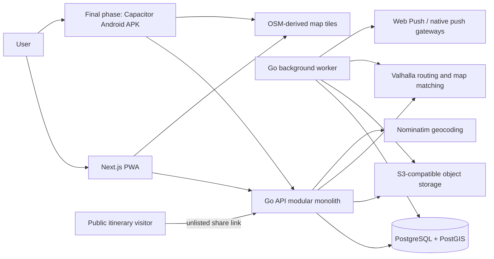
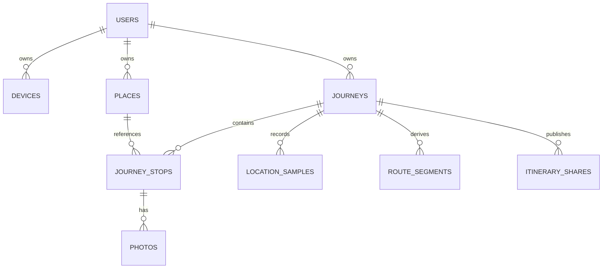
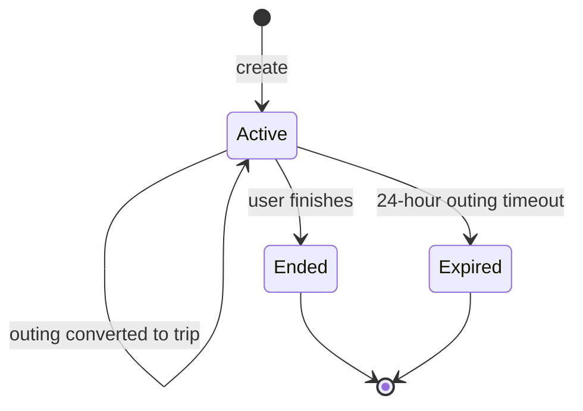

# Pinerary Architecture and Detailed Design

| Field | Value |
| --- | --- |
| Status | Backend baseline implemented; PWA design pending |
| Last updated | 2026-09-21 |
| Intended release | MVP for a small group of independent users |
| Primary backend | Go modular monolith |
| Primary clients | Statically exported Next.js PWA first; Capacitor Android APK in the final phase |

## 1. Purpose

Pinerary is a personal travel and outing journal. It records places, photos, and an automatically captured route; finds previously saved locations near the user; and creates an attractive, publicly shareable itinerary controlled by an unlisted link.

The system is also intended to demonstrate backend-engineering ability at approximately five years of experience. The design therefore emphasizes data modelling, geospatial queries, offline synchronization, idempotency, asynchronous processing, privacy, observability, and failure handling. It deliberately avoids adding distributed infrastructure only for portfolio value.

This document records product decisions, technical decisions, reasons, important alternatives, the implemented backend shape, and unresolved client/deployment questions. The served OpenAPI document remains the authoritative HTTP contract.

## 2. Product scope

### 2.1 MVP capabilities

1. Multiple independent users can maintain private accounts and data.
2. A user can start either a `trip` or an `outing`. The difference is initially a label and lifecycle policy, not a separate data model.
3. The PWA records the route automatically while it remains active in the foreground. Reliable Android background tracking is added in the final Capacitor phase.
4. A user can explicitly pin their current location into the journey timeline.
5. A pin receives a suggested place name through reverse geocoding, but the user can edit it.
6. A user can attach camera photos or existing photos to a pinned stop.
7. Places can also be saved without an active journey.
8. Nearby search includes every place owned by the user, whether it was bookmarked directly or captured during a journey.
9. Nearby results default to motorcycle road distance and show car, motorcycle, and walking time and distance. Users can change the mode, and the app remembers their latest selection. Straight-line distance is only an internal prefilter or a clearly labelled offline fallback.
10. An itinerary can be reordered for one share operation without changing the recorded trip timeline.
11. Sharing produces a formatted message containing a revocable public itinerary link. The public page presents selected stops in a share-only order with snapshot text/coordinates and only explicitly selected photos.
12. Core capture operations continue offline and synchronize later.
13. An outing receives a warning at 23 hours and automatically ends at 24 hours unless converted to a trip.

### 2.2 Delivery stages

1. **PWA product:** Build and release the installable PWA first. It includes all core journeys, pins, photos, nearby search, public sharing, offline synchronization, and foreground route tracking. It must remain useful without background tracking.
2. **Android extension:** In the final development phase, package the existing static Next.js application as a Capacitor Android APK and add reliable locked-screen/background tracking. No native iOS package is planned.

### 2.3 Explicitly deferred

- Destination recommendations
- AI-based place suggestions
- Automatic visit-order optimization
- Collaborative/shared trip editing
- Semantic search and RAG
- Vector embeddings or a vector database
- Turn-by-turn navigation
- Live location sharing with friends

The data model should not prevent these features, but the MVP will not implement their infrastructure.

## 3. Architecture principles

1. **Backend ownership:** Go owns authorization, business rules, persistence, synchronization, geospatial queries, lifecycle transitions, and third-party integrations.
2. **Offline-first capture:** Losing connectivity must not lose a pin, route point, edit, or photo selected by the user.
3. **Preserve historical truth:** Raw GPS samples and the completed journey timeline remain available even when derived routes or share ordering change.
4. **Provider isolation:** Map rendering, geocoding, routing, notifications, and object storage are accessed through narrow interfaces.
5. **Privacy by default:** Route history and photos are sensitive and private. Recording occurs only during an explicitly active journey.
6. **Start operationally simple:** Use a modular monolith and PostgreSQL-backed asynchronous jobs before introducing separate services, Redis, Kafka, or Kubernetes.
7. **At-least-once tolerant:** Mobile synchronization can repeat requests. Every mutation that can be retried must be idempotent.
8. **Measure before scaling:** Add caches or split services only after metrics show a real bottleneck.

## 4. System context



The API and worker use the same Go modules and are built from one repository. They may run as separate processes so that slow background work does not consume API request capacity.

## 5. Decision summary

| Area | Decision | Status | Reason |
| --- | --- | --- | --- |
| Architecture | Modular monolith | Decided | Clear boundaries with low operational overhead |
| Web UI | Next.js App Router with TypeScript, statically exported | Working decision | Strong routing/PWA support without adding a Node business backend |
| Business backend | Go | Decided | Explicit user preference and good concurrency/tooling |
| HTTP framework | Gin | Working decision | Familiar middleware ergonomics while retaining Go performance |
| API style | Versioned REST with OpenAPI | Decided | Fits resource workflows, offline clients, and generated contracts |
| Mobile delivery | PWA first; Capacitor Android APK in the final phase | Decided | Delivers a useful zero-cost cross-platform product before adding Android-only background tracking |
| Main database | PostgreSQL with PostGIS | Decided | Transactions plus indexed geospatial querying |
| Go database access | `pgx` and `sqlc` | Implemented | Efficient PostgreSQL access and explicit, type-safe SQL |
| Migrations | SQL-first migrations with Goose | Implemented | Transparent migrations and a small tool surface |
| Photos | Private S3-compatible object storage | Decided | Durable binary storage without loading the API server |
| Browser offline store | IndexedDB, accessed through Dexie | Working decision | Durable structured client storage and queryable mutation queue |
| Android offline store | SQLite plus native file storage in the final phase | Working decision | Reliable background writes and large-photo handling in the APK |
| Map renderer | MapLibre GL JS in the shared UI | Decided | Open source, compatible with the PWA and Capacitor WebView, and independent of a commercial map vendor |
| Map data | OpenStreetMap-derived data | Decided | Open data and compatible self-hosting path |
| Reverse geocoding | Nominatim behind a backend adapter | Implemented | Open source; can begin with compliant public usage and later self-host |
| Routing | Self-hosted Valhalla | Implemented adapter; deployment pending | Open source, matrices, motorcycle costing, and map matching |
| Default nearby mode | Motorcycle road distance | Decided | Matches the user's primary transport mode while keeping other modes selectable |
| Jobs | PostgreSQL-backed queue; outbox primitive reserved | Implemented | Reliable asynchronous work without Kafka/Redis in the MVP |
| Sharing | Revocable public itinerary page plus native text/link sharing | Decided | Creates a useful, attractive share while retaining owner control |
| Timeline policy | Immutable sequence/timestamps after completion | Decided | Preserves historical truth |
| Share customization | Separate share snapshot/export | Decided | Allows reorder without mutating the journey |
| GPS storage | Raw append-only points plus derived paths | Decided | Allows improved filtering and map matching later |
| Authentication | OIDC-compatible identity; provider not selected | Open | Security, cost, recovery, and browser/Android integration need review |
| Production hosting | Containerized, provider not selected | Open | Free tiers and resource needs change over time |

## 6. Client architecture

### 6.1 Why Next.js

Next.js is a React framework, so this is not a choice between Next.js and React. The client will use React through Next.js.

Next.js provides file-based routing, code splitting, metadata support, and documented PWA support. It also leaves room for server-rendered public pages if the product later adds them. However, business logic will not be implemented in Server Actions or Next.js API routes. Introducing two business backends would duplicate validation and authorization and make offline synchronization harder to reason about.

The MVP uses a static Next.js export. Its HTML, CSS, and JavaScript assets are served as the PWA first and bundled into Capacitor Android only in the final phase. Production does not need a Node.js server. Features that require a Next.js runtime, including Server Actions and dynamic server rendering, are consequently outside the MVP. The dynamic public itinerary page is rendered by Go; if future application pages need Next.js server rendering, the runtime decision can be revisited without moving business ownership out of Go.

Ownership boundary:

- Next.js owns UI composition, browser routing, service-worker registration, local cache interaction, and calling the Go API.
- Go owns all authoritative mutations and reads.
- Next.js does not connect directly to PostgreSQL.
- Browser-visible secrets are never used for privileged provider calls.

Most authenticated map screens will be client components because they use browser location, maps, IndexedDB, camera/file inputs, and live synchronization.

### 6.2 PWA first, Android shell later

The web build is installable as a PWA and supports:

- App-shell caching
- Foreground geolocation
- Offline pins and edits
- Deferred photo upload
- Web Push where supported
- Native share sheet where supported

A pure web application cannot reliably receive continuous location updates while backgrounded or while the phone is locked. The first product explicitly accepts this limitation: tracking works only while the PWA is open and active. The PWA's journeys, explicit pins, photos, nearby search, sharing, and offline synchronization remain fully usable without background tracking.

Only after the PWA is complete and hardened will the same UI be packaged as an Android APK with Capacitor. Capacitor is a native container around the compiled web application, not a second React Native UI. It creates an Android Studio project containing a WebView that loads the static Next.js assets. A JavaScript-to-native plugin bridge lets that UI call Android location services, the camera, native files, and push-notification APIs. Background tracking will require a suitable maintained plugin or a small custom Kotlin plugin; the basic web geolocation API alone is insufficient.

The web and native capabilities must be explicit in the UI:

| Capability | PWA-first release | Android APK, final phase |
| --- | --- | --- |
| Foreground tracking | Yes | Yes |
| Locked-screen/background tracking | No guarantee; not an advertised capability | Required |
| Offline pins and edits | Yes | Yes |
| Offline photo queue | Yes, subject to browser storage limits | Yes |
| Push notifications | Supported-browser dependent | FCM/platform push |

### 6.3 Local persistence abstraction

The application will expose a common local repository/sync interface with two implementations:

- IndexedDB/Dexie for browsers
- SQLite and native file storage for the final Android APK

Large photo blobs should not be stored in SQLite. The Android client stores a file path and metadata in SQLite; the PWA stores a `Blob` in IndexedDB until it is uploaded.

Local records use client-generated UUIDs so the UI can create relationships while offline. The current API stores them as idempotency/sample identifiers and returns server-generated resource IDs.

### 6.4 Client mutation outbox

Every offline-capable mutation is first written to a local outbox:

```text
pending -> sending -> acknowledged
                  -> retryable_failure
                  -> permanent_failure
```

Each entry includes:

- Mutation ID / idempotency key
- User and device IDs
- Entity ID
- Operation type
- Payload
- Creation time
- Attempt count and last error

Retries use exponential backoff with jitter. Authentication errors pause the queue until the user signs in again. Validation conflicts are shown to the user instead of retrying indefinitely.

## 7. Backend architecture

### 7.1 Modular monolith

The initial backend is one logical application divided into packages with explicit responsibilities:

```text
identity       OIDC token verification, principals, user provisioning
journeys       lifecycle, stops, timeline invariants
places         owner-scoped saved places and stop snapshots
tracking       GPS ingestion, cleaning, track derivation
nearby         candidate selection and route-time enrichment
media          upload lifecycle, metadata, thumbnails
sharing        share snapshots, public links, and page/text rendering
notifications  notification subscriptions and dispatch
jobs           durable jobs, leasing, retries, dead letters
httpapi/config/database/telemetry  platform adapters
```

Modules communicate through service interfaces or explicit domain events. Handlers must not reach directly into another module's tables.

This provides interview-relevant boundaries without introducing distributed transactions, network failure between internal modules, or multiple deployments.

### 7.2 Gin usage rules

Gin provides HTTP routing, middleware, request binding, and response writing. To avoid framework lock-in:

- `gin.Context` remains in the transport layer.
- Services accept standard `context.Context` and domain values.
- Authorization is checked before calling domain services.
- Shared transport helpers map domain errors consistently.
- Business services never write HTTP responses.

Fiber was not selected because its native stack differs from `net/http`; interoperability requires adapters and changes request semantics. The expected bottlenecks are database work, object storage, and routing calls, so Fiber's synthetic HTTP throughput is not a meaningful advantage here.

### 7.3 API conventions

- Base path: `/api/v1`
- JSON for normal requests and responses
- Stable error envelope containing code, message, and request ID
- UTC RFC 3339 timestamps on the wire
- Cursor pagination rather than offset pagination for growing lists
- Stable `client_request_id` or `sample_id` fields make offline-retryable creates and batch ingestion idempotent
- Optimistic version on mutable aggregate roots
- Request correlation ID propagated into logs and provider calls
- OpenAPI is the contract used to generate or validate clients

Representative endpoints:

```text
POST   /api/v1/journeys
POST   /api/v1/journeys/{id}/convert-to-trip
POST   /api/v1/journeys/{id}/end
GET    /api/v1/journeys/{id}

POST   /api/v1/journeys/{id}/stops
PATCH  /api/v1/journeys/{id}/stops/{stopId}
POST   /api/v1/journeys/{id}/locations/batch
GET    /api/v1/journeys/{id}/route

POST   /api/v1/places
GET    /api/v1/places/nearby

POST   /api/v1/photos/upload-intents
POST   /api/v1/photos/{id}/complete

POST   /api/v1/journeys/{id}/shares
DELETE /api/v1/share-links/{id}
GET    /s/{publicToken}
POST   /api/v1/devices
```

### 7.4 Database access

Use PostgreSQL through `pgx`; use `sqlc` to generate typed methods from reviewed SQL. Geospatial SQL will remain explicit because ORM abstractions commonly obscure spatial indexes and query plans.

Database operations accept the request `context.Context`; outbound provider clients enforce explicit timeouts. Multi-table state changes use database transactions. Migrations are SQL-first so indexes, constraints, PostGIS types, and generated expressions remain visible during review.

## 8. Data model

### 8.1 Relationship overview



### 8.2 Core tables

#### `users`

- `id UUID` primary key
- External OIDC subject
- Display name
- Preferred nearby transport mode, defaulting to `motorcycle`
- Created/updated timestamps

#### `devices`

- `id UUID`
- `user_id`
- Device-generated installation identifier
- Push-subscription metadata
- Last-seen timestamp

A user can have multiple devices. Device identity supports per-installation push subscriptions and targeted subscription cleanup; it is not a substitute for user authentication.

#### `places`

- `id UUID`
- `owner_id`
- `location geography(Point, 4326)`
- User-editable name and notes
- Stable client request ID
- Soft-deletion timestamp
- Created/updated timestamps

The MVP deliberately keeps each place private and owner-scoped instead of introducing a global canonical-place table. Pinning during a journey atomically creates a place and a stop, so visited and standalone locations appear in one library. A future provider-identity layer can be added without rewriting historical stop snapshots.

#### `journeys`

- `id UUID`
- `owner_id`
- `kind`: `trip` or `outing`
- `status`: `active`, `ended`, or `expired`
- Label
- Started/ended timestamps
- Stable client request ID
- Optimistic `version`

Creation starts a journey immediately. One active journey per user is enforced with a partial unique index, removing ambiguity about where automatic GPS samples belong.

#### `journey_stops`

- `id UUID`
- `journey_id`
- `place_id`
- Location snapshot `geography(Point, 4326)`
- User-editable display-name snapshot
- Client capture time
- Original sequence number
- Stable client request ID
- Note
- Created/updated timestamps

The location snapshot prevents later edits to a reusable place from rewriting history.

#### `location_samples`

- `journey_id`
- Client-generated `sample_id`
- Client capture timestamp and server creation timestamp
- `location geography(Point, 4326)`
- Horizontal accuracy
- Speed and heading, nullable
- Acceptance flag and rejection reason

The uniqueness constraint `(journey_id, sample_id)` makes batch retries idempotent. Raw points are append-only. Invalid-looking samples are flagged rather than destroyed.

#### `route_segments`

- `journey_id` and segment number
- Started/ended timestamps
- Cleaned path `geography(LineString, 4326)`
- Map-matched path, nullable
- Distance and duration

#### `photos`

- `id UUID`
- `owner_id`, `journey_id`, and optional `stop_id`
- Private object key
- Thumbnail object key
- Status: `pending`, `uploaded`, `processed`, or `failed`
- Content type and byte size
- Cryptographic checksum
- Stable client request ID and captured time
- Created/updated timestamps

#### `itinerary_shares`

- `id UUID`
- `journey_id` and `owner_id`
- Hash of a high-entropy public token
- Immutable JSON snapshot containing ordered stop presentation and selected photos
- Optional expiration time
- Revocation time, nullable
- Creation timestamp

Only the token is placed in the public URL; the database stores its cryptographic hash. A link can be revoked without deleting the underlying journey. The snapshot's order and text overrides do not mutate journey stops.

#### Operational tables

- `outbox_events`
- `background_jobs`

Push subscriptions are stored on device registrations. Dedicated audit events and self-service account export/deletion are pre-public-launch hardening work, not part of the current backend baseline.

### 8.3 Spatial indexes

At minimum:

```sql
CREATE INDEX places_location_gist ON places USING GIST (location);
CREATE INDEX location_samples_location_gist ON location_samples USING GIST (location);
```

The exact nearby query must be verified with `EXPLAIN (ANALYZE, BUFFERS)` against representative data. `ST_DWithin` should be used for radius filtering, and nearest-neighbour ordering should use the PostGIS distance operator so the spatial index can participate.

## 9. Journey lifecycle and immutability



Rules:

1. Only an active journey accepts automatic track points and new timeline stops.
2. Converting an outing to a trip changes `kind`; it does not create a second journey.
3. At 23 hours, an active outing produces a conversion warning.
4. At 24 hours, an unconverted outing is completed by a durable server job.
5. A missed push notification does not prevent server-side completion.
6. After ending, stop sequence, visit timestamp, and captured coordinates are immutable.
7. Stop names can be corrected and photos can be added after ending.
8. Reopening an ended journey is outside the MVP.
9. Share-specific order and text belong to an itinerary snapshot, never the journey.

## 10. Automatic route tracking

### 10.1 Collection

In the PWA-first release, `watchPosition` records samples only while a journey is active and the application remains in the foreground. It persists samples to IndexedDB before synchronization and clearly tells users that locking the phone or backgrounding the PWA may pause the route.

In the final Android phase, a native location component continues collection while the screen is locked or the app is backgrounded. It records only during an active journey and uses the persistent Android notification/foreground-service behaviour required by the platform.

Sampling must be adaptive and configurable rather than permanently hard-coded. It should consider:

- Distance moved
- Time since previous accepted sample
- Reported accuracy
- Detected motion/activity where available
- Foreground/background state
- Battery state

The initial calibration target is a useful walking/driving path without second-by-second sampling throughout a long stationary period. Exact intervals will be chosen through real-device tests.

Every raw sample is persisted locally before network transmission. Samples are uploaded in bounded batches of at most 500. The API accepts late and out-of-order batches and deduplicates them by stable sample ID.

### 10.2 Noise-processing pipeline

Processing is asynchronous and versioned:

1. Validate coordinate bounds and required metadata.
2. Sort by device timestamp while retaining server receipt time.
3. Mark stale samples, very poor reported accuracy, duplicate positions, and impossible velocity/acceleration transitions.
4. Build a cleaned candidate trace from points not excluded by quality rules.
5. Split the trace across large time gaps or implausible jumps instead of drawing a false connecting line.
6. Run Valhalla map matching against the cleaned segments.
7. Retain both cleaned and map-matched geometry.
8. Simplify display geometry at multiple tolerances if payload size requires it.

Raw points are never overwritten by this process. Processing records a pipeline version so improved algorithms can regenerate the derived path later.

A Kalman filter is not part of the first version. Reported accuracy filtering, movement plausibility, segment splitting, and Valhalla's map matcher should be evaluated first. Adding another smoothing algorithm without recorded evidence could hide real detours or create artificial ones.

### 10.3 Failure behaviour

- If map matching fails, show the cleaned route.
- If processing is delayed, show the raw/cleaned route with a processing status.
- If a client is killed before upload, locally persisted points synchronize on the next launch.
- If the app loses authorization, tracking pauses and the user sees a prominent warning.
- The current schema deduplicates by journey and sample ID. Explicit per-device track separation is deferred until the Android tracking design requires it.

## 11. Places and nearby search

### 11.1 Place capture

When a user pins their location:

1. The client captures the device coordinate and accuracy.
2. It immediately creates an offline local record.
3. When online, the backend requests reverse-geocoding suggestions.
4. The user may accept or replace the suggested name.
5. Provider data never silently replaces the originally captured coordinate.

Nominatim is behind a backend adapter and cache. The public service is limited to light, user-triggered usage; it permits neither high-volume use nor autocomplete. The provider can be replaced or self-hosted without a client release.

### 11.2 Nearby algorithm

Computing road times for every saved place is unnecessarily expensive. Nearby search uses two stages:

1. PostGIS selects a bounded candidate set using indexed straight-line distance. This is an implementation detail, not the default distance shown to the user.
2. Valhalla calculates one-to-many matrices for car, motorcycle, and walking costing.
3. The backend ranks by road distance for the selected transport mode and returns ten results by default. The first-time default is `motorcycle`; the user's profile stores the preferred mode.

The response includes:

- Road distance and duration for each available mode
- The criterion actually used for sorting

If a non-selected mode fails, its estimate is omitted. If the selected mode fails, the endpoint returns `503` instead of silently treating straight-line distance as road distance. An offline client may present locally computed straight-line distance only when it clearly labels it as approximate and waits until online for road results.

Candidate-set size and search radius are configuration values and should be tuned using correctness and latency tests. A small straight-line shortlist can miss a road-near place separated by a river or restricted road network, so the UI must not claim mathematical exactness unless all relevant places were routed.

## 12. Maps, geocoding, and routing

### 12.1 Map rendering

Use MapLibre GL JS rather than a commercial map SDK. The shared Next.js UI runs it in both the browser and, in the final phase, the Capacitor Android WebView. MapLibre Native remains a possible later optimization if WebView map performance is inadequate, but it is not part of the MVP. MapLibre is a renderer; it does not itself provide map data or hosted tiles.

During early development and a very small friends-only trial, public OpenStreetMap tiles may be used only within the published usage policy. They must not be bulk downloaded or used to implement offline map-area downloads.

For offline maps or increased usage, use self-hosted OSM-derived vector tiles or regional PMTiles/MBTiles packages with required attribution. Offline application data is an MVP requirement; fully offline basemap coverage is a separate deployment decision.

### 12.2 Geocoding

Use Nominatim for reverse geocoding through a `Geocoder` interface. Cache permissible results, identify the application correctly, serialize upstream requests at no more than one per second per API process, and avoid autocomplete against the public server. A self-hosted Nominatim/Photon/Pelias deployment can replace it later.

### 12.3 Routing and map matching

Use Valhalla through interfaces similar to:

```go
type RouteMatrix interface {
    Matrix(ctx context.Context, request MatrixRequest) (MatrixResult, error)
}

type MapMatcher interface {
    Match(ctx context.Context, trace Trace) (MatchedTrace, error)
}
```

Valhalla was selected because it is open source and supports time-distance matrices, pedestrian/auto routing, motorcycle-oriented costing, and GPS trace matching. Start with a regional graph rather than global data to control memory, storage, and update time.

Traffic-aware real-time duration is not promised. OpenStreetMap-based routing generally estimates from road attributes and configured speeds, not proprietary live traffic.

## 13. Photo storage and processing

Photos are private objects. PostgreSQL stores metadata; an S3-compatible store holds binary data.

Online flow:

1. Client requests an upload reservation.
2. API creates a `pending` asset with a unique object key.
3. API returns a short-lived presigned upload URL.
4. Client uploads directly to object storage.
5. Client completes the reservation with size/checksum metadata.
6. A job validates the object and generates thumbnails.
7. Asset becomes `processed` and is available through a short-lived thumbnail URL.

Offline flow:

1. Store the photo locally with a local media record.
2. Display the local preview immediately.
3. On reconnection, obtain a fresh upload reservation.
4. Upload and complete as above.

Security rules:

- Never accept a client-selected object key.
- Restrict content type and maximum size.
- Verify magic bytes rather than trusting the extension.
- Use checksums to detect incomplete or corrupted uploads.
- Strip unnecessary EXIF metadata from derived/shared images; retain original metadata only if the privacy policy explicitly allows it.
- Use private buckets and time-limited reads.
- An hourly worker claims and removes uploads still pending after 24 hours. The atomic claim prevents cleanup from racing a concurrent completion.

## 14. Public itinerary sharing

Sharing creates an immutable presentation snapshot and a revocable unlisted link. It does not make the original journey mutable or globally discoverable.

Flow:

1. Client builds a preview with selected stops, share-only order, optional text overrides, and explicitly selected photos.
2. Backend validates that every stop/photo belongs to the user and journey.
3. Backend stores an immutable snapshot and a SHA-256 hash of a high-entropy public token.
4. The Go server renders `GET /s/{token}` as responsive HTML with Open Graph metadata so WhatsApp can produce a useful link preview without executing JavaScript.
5. The page shows a styled stop timeline/map, snapshot notes and coordinates, and only the photos selected for that link.
6. Client passes a short formatted message and the URL to the native/Web Share sheet.
7. If the share API is unavailable, offer copy-to-clipboard and an encoded WhatsApp link.

Example:

```text
Jaipur Trip — 12–14 September
Here is my itinerary:
https://pinerary.example/s/<unguessable-token>
```

The public route is served by Go using an HTML template and shared static styling, so the MVP keeps its static Next.js deployment and does not add a Node server. A public page returns `404` after revocation or expiration. Tokens must not appear in routine logs or analytics. Public pages use `Referrer-Policy: no-referrer` and `X-Robots-Tag: noindex, nofollow`, and the share flow warns the owner that anyone possessing the URL can view the selected content.

## 15. Offline synchronization and conflicts

### 15.1 Consistency model

- The local database is the immediate source for UI rendering while offline.
- PostgreSQL is the authoritative system of record after synchronization.
- Creates use stable client-generated idempotency/sample IDs.
- Journey mutations use optimistic versions.
- The API may process a request more than once internally, but the observable mutation occurs once.

### 15.2 Conflict rules

- Ended journey sequence/time/location changes are rejected because no endpoint exposes them.
- Concurrent journey edits use optimistic concurrency; place/stop metadata currently uses last accepted write.
- Photo additions commute and can be synchronized independently.
- Duplicate GPS batches are acknowledged without reinserting points.
- An outing auto-completed by the server rejects new stops/points; the client retains rejected local data for explicit recovery rather than discarding it.

## 16. Jobs and reliable events

Use PostgreSQL for the initial durable job queue. Workers claim jobs with row locks such as `FOR UPDATE SKIP LOCKED`, set leases, retry transient failures with exponential backoff, and send permanently failing jobs to a reviewable dead-letter state.

Feature services insert dependent jobs in the same PostgreSQL transaction as state changes. An outbox table and typed queries are also present for future external event delivery, but no external broker is used.

Initial job types:

- Outing 23-hour warning
- Outing 24-hour auto-completion
- Track cleaning/map matching
- Photo verification and thumbnail generation
- Hourly abandoned-photo cleanup

Notification attempts occur inside the warning job; expiry remains independent of successful delivery.

Redis, Kafka, and a separate workflow engine are not justified for the MVP.

## 17. Notifications

The server, not the client timer, determines outing deadlines. A scheduler creates durable notification and completion jobs.

Notification delivery is abstracted because channels differ:

- Web Push for installed/supported PWAs
- FCM for the final Capacitor Android APK

Delivery is best effort. The lifecycle action is not dependent on a notification being seen. Expired or invalid subscriptions are removed after provider responses indicate they are no longer valid.

The Android APK will not require Google Play distribution. For the small friends-only group, use Google's free limited-distribution account or direct sideloading under the then-current Android verification rules. No Apple Developer Program or native iOS distribution is planned.

## 18. Security and privacy

Location history can reveal home, work, habits, and current whereabouts. It must receive stricter treatment than ordinary profile data.

Implemented application controls:

- Authentication and ownership checks on every private resource
- Parameterized SQL only
- Private object storage
- Short-lived signed upload/read URLs
- Automatic stop for outings
- No tracking when no journey is active
- Per-user limits on costly authenticated endpoints and per-IP limits on public share reads
- Secrets stored outside source control
- Location and tokens excluded from routine logs

The deployment must terminate HTTPS, enable encryption at rest, and add an edge limiter if aggregate limits across API replicas are required. The PWA must add explicit permission, visible recording state, and an immediate stop control. Security audit events and self-service account export/deletion remain required hardening before a public launch; Nominatim upstream requests are already serialized and cached.

Authorization should be implemented at the service/repository boundary, not only in the UI. Every query for user-owned data includes the authenticated user ID. PostgreSQL row-level security may be added as defence in depth, but it does not replace application checks.

Retention periods for raw GPS points and original photos remain an open product decision. Users should eventually be able to delete raw tracks independently of the summarized journey.

## 19. Authentication decision boundary

Multiple independent users require real authentication, but the provider is not selected yet.

The architecture assumes:

- A stable internal user UUID
- An external issuer/subject pair
- Short-lived access credentials
- Refresh/session revocation
- Device/session listing
- Compatibility with browser/PWA clients and the later Android APK

The preferred direction is standards-based OIDC rather than implementing password storage. The final choice must consider:

- Free-tier and self-hosting limits
- Account recovery
- Identity-provider policies for PWAs and packaged Android apps
- Android deep-link handling
- Go token verification
- Avoiding a permanent dependency on Next.js as an authentication backend

The backend boundary is already provider-neutral: it performs OIDC discovery and validates signature, issuer, audience, and expiry. The production provider and account-recovery flow must be selected before deployment; development mode is local-only.

## 20. Observability

The backend uses OpenTelemetry-compatible HTTP/provider/job traces, aggregate Prometheus-format HTTP metrics, and structured logs.

### Logs

- JSON structured logs
- Correlation/request ID
- No raw coordinates, access tokens, signed URLs, or photo metadata in normal logs

### Metrics

- API request count, 5xx count, in-flight count, and cumulative duration are currently exposed.
- Per-route histograms, database pool metrics, job backlog, provider errors, upload outcomes, and push outcomes should be added to the production dashboard before broader use.

### Traces

Trace API request -> database -> provider/queue operations, with coordinate payloads redacted.

## 21. Testing strategy

### Unit tests

- Journey transition rules
- Outing deadline logic
- Timeline immutability
- Share rendering
- GPS quality classification
- Idempotency decisions

### Integration tests

Use a real PostgreSQL/PostGIS container for:

- Spatial queries and indexes
- Ownership isolation
- Idempotent journey creation

Transaction, concurrent journey creation, GPS deduplication, and job-leasing behaviour have unit coverage or query-level design, but broader database integration coverage remains release hardening.

Provider adapters use stubbed HTTP servers for Valhalla/Nominatim failure scenarios. Photo processing uses an in-memory object-store fake; an end-to-end MinIO test remains pre-release work.

### Contract tests

- Validate handlers against OpenAPI
- Reject an invalid OpenAPI document in CI/tests
- Add backward-compatibility checks once a released PWA depends on the contract

### End-to-end/device tests

- Offline start/pin/photo/reconnect
- Foreground PWA tracking on real iOS and Android devices
- Background and locked-screen tracking on real Android devices in the final phase
- Permission revocation during recording
- App termination and recovery
- Cross-timezone trip capture
- 24-hour outing completion
- WhatsApp/native link sharing and public-page rendering, revocation, expiration, and photo selection

### Performance tests

- GPS batch ingestion
- Nearby queries with realistic place counts
- Track processing for long journeys
- Concurrent presigned upload initiation

## 22. Deployment and cost strategy

### 22.1 Local development

Use containers for:

- PostgreSQL/PostGIS
- MinIO

Run Valhalla separately with a small regional extract. An optional local geocoder can replace the public adapter endpoint.

Next.js and Go may run directly for fast reload or through containers for parity.

### 22.2 Production shape

Initially deploy:

- One Go API instance
- One Go worker instance
- PostgreSQL/PostGIS
- S3-compatible storage
- Regional Valhalla instance
- Static/Next.js frontend hosting

Self-hosted tiles/geocoder can be added as public-service limits are approached. Valhalla and geocoding datasets may be the largest infrastructure cost, so use only required geographic extracts initially.

Do not design around a particular provider's free tier. Free-tier limits change. Containers, standard protocols, and provider interfaces preserve portability.

### 22.3 Cost controls

- No commercial route-matrix calls
- Regional rather than global routing graphs
- Direct-to-object-storage uploads
- Compressed GPS batches
- Candidate preselection before route matrices
- Cached compliant reverse-geocoding results
- Storage lifecycle rules for abandoned uploads and optional originals
- Resource quotas and monitoring alerts

## 23. Scalability path

The modular monolith is expected to handle the friends-only MVP comfortably. Likely future pressure points are:

1. Track-point volume
2. Valhalla CPU/memory usage
3. Photo storage/egress
4. Background job backlog

Potential evolutions, only when measured:

- Time/range partition `location_samples`
- Read replicas for analytical/history views
- Extract track processing into an independently scaled worker service
- Add a cache for repeated permitted computations
- Separate routing instances by region
- Move the job queue to a dedicated system if PostgreSQL job contention becomes material

Application module boundaries and the transactional outbox make later extraction possible, but no service extraction is part of the MVP.

## 24. Future-scope compatibility

The current design supports future planning and semantic retrieval without implementing them:

- Owner-scoped `places` preserve the user's private library and notes.
- `journey_stops` preserve temporal visit context.
- Stable IDs allow future planned stops to reference the same places.
- Raw notes and media metadata remain available for future indexing.
- Capture timestamps support temporal questions; explicit origin timezone metadata can be added with planner requirements.
- Provider adapters allow recommendation/routing changes.

A future planner can add planned journeys/stops and optimization without changing completed historical stops. A future RAG feature can index authorized notes and media descriptions. Neither a vector database nor embedding pipeline should be deployed until those features are actually designed.

## 25. Delivery slices

The chosen delivery order is:

1. **Backend baseline — complete:** Go API/worker, OIDC boundary, PostGIS data model, journeys, places, tracking, media, nearby routing, sharing, lifecycle jobs, OpenAPI, tests, and operations documentation.
2. **PWA design and vertical UI slices — next:** low-fidelity mobile interactions, static Next.js shell, IndexedDB outbox, journeys/pins, foreground tracking, media, nearby, sharing, and Web Push.
3. **PWA hardening and release:** cross-browser/device tests, privacy UI, API hardening gaps, account export/deletion, and operational validation.
4. **Final Android phase:** add Capacitor, Android SQLite/native file adapters, background-location collection, FCM integration, locked-screen tests, signed APK generation, and zero-cost limited distribution/sideloading.

## 26. Open decisions

These items are intentionally not presented as final:

1. Identity provider and account-recovery design
2. Exact GPS sampling policy after PWA and Android real-device battery/accuracy tests
3. Production hosting provider and geographic region
4. Initial supported routing/map dataset region
5. Whether offline basemap downloads are MVP scope or only offline user data
6. Raw GPS and original-photo retention policy
7. Photo size/count limits
8. Whether one user may deliberately record the same active journey on multiple devices
9. The grace/recovery experience for unsynchronized data arriving after an outing auto-closes

## 27. References and external constraints

- [Next.js PWA guide](https://nextjs.org/docs/app/guides/progressive-web-apps)
- [Capacitor documentation](https://capacitorjs.com/docs)
- [W3C Geolocation specification](https://www.w3.org/TR/geolocation/)
- [Android limited distribution](https://developer.android.com/developer-verification/guides/limited-distribution)
- [Android alternative distribution](https://developer.android.com/distribute/marketing-tools/alternative-distribution)
- [Fiber `net/http` adapter documentation](https://docs.gofiber.io/middleware/adaptor/)
- [PostGIS spatial-query guidance](https://postgis.net/docs/manual-dev/en/using_postgis_query.html)
- [MapLibre GL JS documentation](https://maplibre.org/maplibre-gl-js/docs/)
- [Valhalla API overview](https://valhalla.github.io/valhalla/api/)
- [Valhalla matrix API](https://valhalla.github.io/valhalla/api/matrix/)
- [Nominatim usage policy](https://operations.osmfoundation.org/policies/nominatim/)
- [OpenStreetMap tile usage policy](https://operations.osmfoundation.org/policies/tiles/)
- [AWS S3 presigned-upload model](https://docs.aws.amazon.com/AmazonS3/latest/userguide/PresignedUrlUploadObject.html)
