# Pinerary Backend — Detailed Design and Repository Guide

| Field | Value |
| --- | --- |
| Document type | As-built design and code-reading guide |
| Backend status | MVP baseline ready for PWA integration; production hardening remains |
| Last reviewed | 2026-09-22 |
| Language/framework | Go 1.24, Gin, `net/http` |
| Persistence | PostgreSQL 17 + PostGIS, `pgx`, `sqlc`, Goose |
| Runtime roles | API, worker, migration command |
| Contract | OpenAPI 3.0.3 at `backend/internal/httpapi/openapi.yaml` |

## 1. Executive summary and readiness

The repository contains a coherent backend baseline, not a mock server. It implements authentication, independent-user isolation, journey lifecycle, saved places, immutable timeline stops, GPS ingestion and cleanup, Valhalla map matching, private photo processing, road-ranked nearby search, public itinerary snapshots, outing expiry, rate limiting, telemetry, migrations, and a durable PostgreSQL worker.

It compiles and its unit, race, contract, and integration suites pass. The integration suite now drives an authenticated HTTP journey workflow against real PostGIS. A live local run has also verified migrations, API/worker startup, PostGIS persistence, direct MinIO upload, thumbnail processing, GPS cleanup and Valhalla map matching, motorcycle road ranking, journey completion, and public sharing.

| Question | Answer |
| --- | --- |
| Is the code buildable? | Yes. API, worker, and migration binaries build. |
| Can Postman call it today? | Yes. PostgreSQL/PostGIS, MinIO, and Delhi Valhalla are installed locally, and the supplied collection targets the development API. |
| Can every feature be exercised immediately? | Delhi road ranking and map matching work. Reverse geocoding needs Nominatim connectivity, and coordinates outside the loaded routing graph need another extract. |
| Is development authentication available? | Yes. Any non-empty bearer token becomes a stable local user. |
| Has a real full-stack smoke test passed locally? | Yes, including motorcycle matrices and asynchronous GPS map matching against Valhalla 3.9.0. |
| Should the frontend start now? | Yes. The typed OpenAPI contract and database-backed HTTP workflow test provide a stable MVP integration baseline. |

## 2. System context

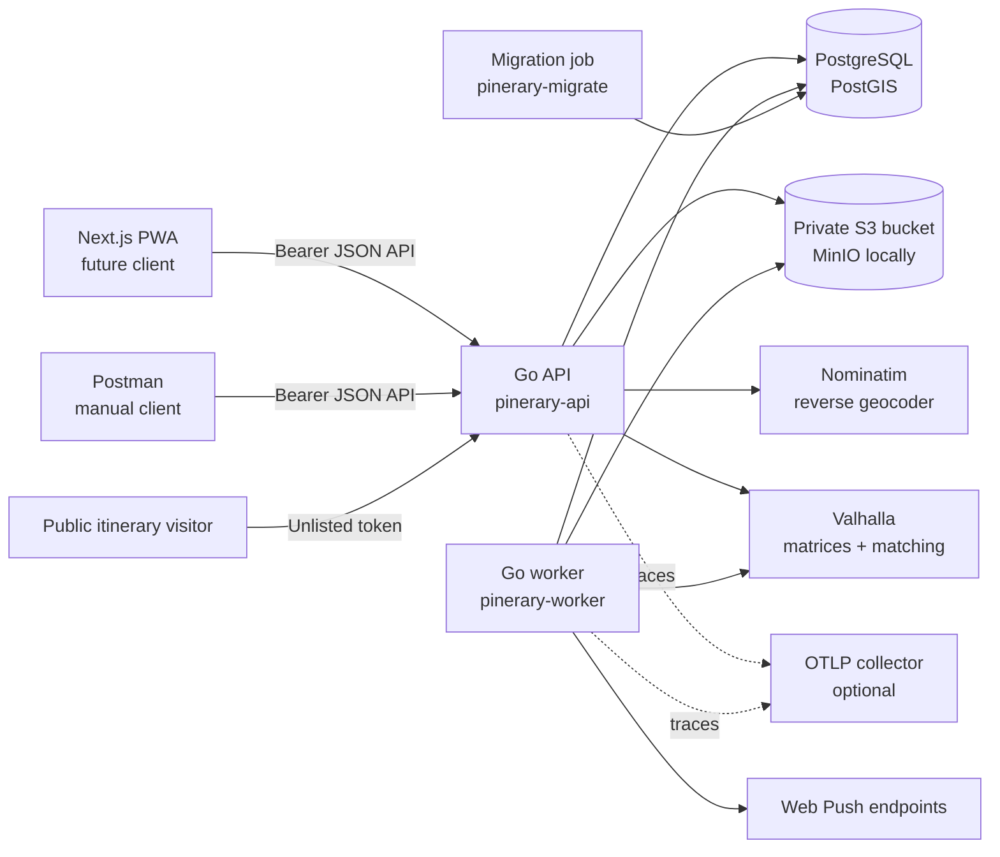

The API and worker share the same domain/query code but run as separate processes. Slow route and image work therefore does not occupy HTTP request handlers. PostgreSQL is both the system of record and the durable job queue; Redis, Kafka, and Kubernetes are deliberately absent.

## 3. Runtime and deployment topology

```mermaid
flowchart TB
    subgraph OneImage[One backend container image]
        APIBin[/pinerary-api]
        WorkerBin[/pinerary-worker]
        MigrationBin[/pinerary-migrate]
    end

    LB[HTTPS ingress / load balancer] --> API1[API replica 1]
    LB --> API2[API replica N]
    API1 --> PG[(PostgreSQL/PostGIS)]
    API2 --> PG
    Worker1[Worker replica 1] --> PG
    Worker2[Worker replica N] --> PG
    API1 --> Objects[(S3-compatible storage)]
    API2 --> Objects
    Worker1 --> Objects
    Worker2 --> Objects
    API1 --> Valhalla[Regional Valhalla]
    Worker1 --> Valhalla
    Deploy[Deployment pipeline] --> MigrationBin
    MigrationBin --> PG
```

The Dockerfile produces one distroless image containing all three binaries. `/pinerary-api` is the default entrypoint; deployment definitions override the entrypoint for worker and migration roles. Migrations run before API/worker rollout.

Local Compose starts:

- PostgreSQL/PostGIS on port `5432`
- MinIO S3 API on `9000` and console on `9001`
- Valhalla 3.9.0 on `8002`, with its routing graph persisted in a Docker volume

The initial graph uses BBBike's New Delhi extract: longitude `76.98–77.50`, latitude `28.44–28.74`. This is intentionally compact development coverage for central Delhi and nearby Gurugram/Noida/Ghaziabad areas, not the full statutory NCR. Goa is the next planned region; its Western Zone PBF can be added to the same graph without changing the backend URL. A country-scale graph can replace these extracts later.

## 4. Repository map

```text
Pinerary/
├── backend/
│   ├── cmd/
│   │   ├── api/          HTTP process composition root
│   │   ├── worker/       Background job composition root
│   │   ├── migrate/      Embedded Goose migration runner
│   │   └── vapid/        Web Push key generator
│   ├── internal/
│   │   ├── httpapi/      Gin transport, middleware, OpenAPI, public HTML
│   │   ├── identity/     OIDC and development token verification
│   │   ├── journeys/     Journey state and optimistic transitions
│   │   ├── places/       Saved places and journey stop timeline
│   │   ├── tracking/     Samples, cleaning, route derivation, map matching
│   │   ├── geocoding/    Cached Nominatim adapter
│   │   ├── routing/      Valhalla matrix and map-matching adapter
│   │   ├── nearby/       PostGIS shortlist plus road ranking
│   │   ├── media/        Upload reservations, thumbnails, cleanup
│   │   ├── sharing/      Immutable snapshots and public tokens
│   │   ├── notifications/ Web Push and outing lifecycle jobs
│   │   ├── jobs/         Leasing, retries, stale recovery, dead letters
│   │   ├── objectstore/  MinIO/S3 adapter
│   │   ├── database/     Pool, transactions, SQL, migrations, generated code
│   │   ├── telemetry/    OpenTelemetry bootstrap
│   │   └── apierror/     Safe public error mapping
│   ├── test/             Recorded performance baseline
│   ├── Dockerfile
│   ├── Makefile
│   ├── sqlc.yaml
│   └── .env.example
├── infra/compose.yaml    Local PostgreSQL/PostGIS and MinIO
├── docs/                 Architecture, API, operations, and this guide
└── .github/workflows/    Test, lint, integration, and container CI
```

### 4.1 Dependency direction

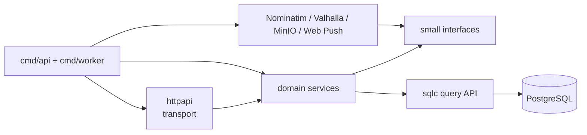

Important boundary: `gin.Context` stays in `internal/httpapi`. Domain services receive standard `context.Context`, UUIDs, and domain structs. SQL remains explicit so ownership predicates, transactions, PostGIS functions, and indexes are reviewable.

## 5. Process startup

### 5.1 API startup

`backend/cmd/api/main.go` is the API composition root.

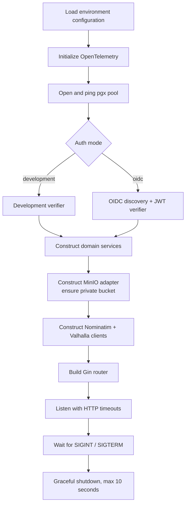

API startup fails fast if PostgreSQL cannot be pinged, OIDC configuration/discovery fails, or the object bucket cannot be checked/created. Valhalla and Nominatim are validated syntactically at startup but contacted only when their features are called.

Server limits:

| Limit | Value |
| --- | --- |
| Read header timeout | 5 seconds |
| Read/write timeout | 30 seconds |
| Idle timeout | 2 minutes |
| Graceful shutdown | 10 seconds |
| JSON request body | 1 MiB |

### 5.2 Worker startup

`backend/cmd/worker/main.go` creates one runner and registers these handlers:

| Job type | Handler |
| --- | --- |
| `track.process` | GPS quality filtering and route segmentation |
| `track.match` | Valhalla map matching |
| `photo.process` | Magic-byte validation and JPEG thumbnail generation |
| `photo.cleanup` | Stale pending/failed object and row cleanup |
| `outing.warn` | Web Push conversion reminder at hour 23 |
| `outing.expire` | Server-authoritative expiry at hour 24 |

At startup the worker requeues jobs whose lease has been `running` for more than 15 minutes and schedules the current hourly photo-cleanup job.

### 5.3 Migration command

`pinerary-migrate <up|down|status>` uses Goose with SQL files embedded into the binary. The deployed command does not need a migrations directory mounted beside it.

## 6. HTTP request pipeline

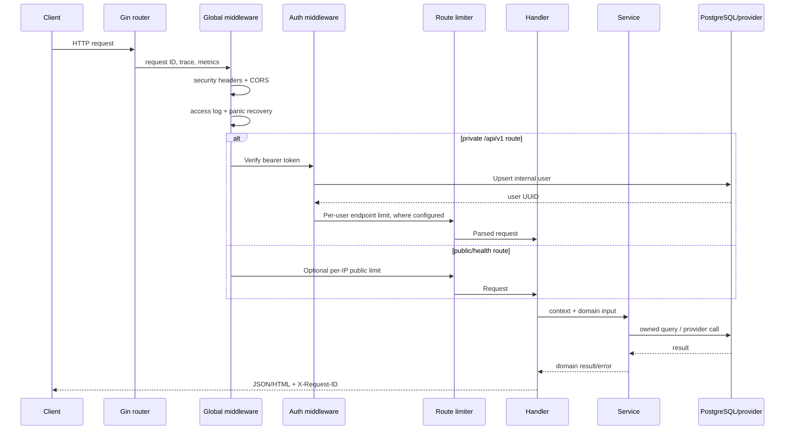

Global middleware order is intentional:

1. Generate or propagate `X-Request-ID`.
2. Create the OpenTelemetry HTTP span.
3. Count requests, 5xx responses, in-flight work, and cumulative duration.
4. Add CSP, referrer, MIME-sniffing, and frame-denial headers.
5. Apply exact-origin CORS.
6. Emit a structured completion log without bodies or coordinates.
7. Recover panics into a safe `500` envelope.

Gin's default trust of all proxy headers is disabled. Deployments behind a proxy must explicitly establish correct client-IP handling at the edge.

## 7. Authentication and authorization

### 7.1 Development mode

With `PINERARY_AUTH_MODE=development`, the token itself becomes a local subject:

```text
Authorization: Bearer alice
                 │
                 └── subject = development:alice
```

Using `alice` consistently returns the same internal user; `bob` produces an independent user. This is suitable for Postman and frontend development only.

### 7.2 OIDC mode

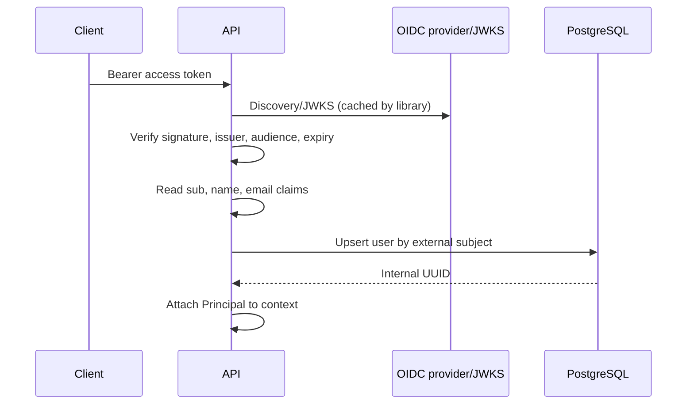

Every private repository query includes the authenticated owner/user ID or joins through an owned journey. A missing resource and another user's resource both normally appear as `404`, avoiding ownership disclosure.

The deployment supports one configured issuer. The database stores its subject string, so selecting/changing the production identity provider requires a migration/account-linking plan.

## 8. Error and concurrency model

All transport errors use:

```json
{
  "error": {
    "code": "journey_conflict",
    "message": "journey version or state conflicts with this operation",
    "request_id": "..."
  }
}
```

| HTTP status | Meaning |
| --- | --- |
| `400` | Invalid JSON, query parameter, or UUID syntax |
| `401` | Missing/invalid bearer token |
| `404` | Resource missing, expired/revoked share, or not owned |
| `409` | Journey lifecycle/version conflict |
| `422` | Structurally valid request that violates domain validation |
| `429` | Endpoint rate limit; includes `Retry-After` |
| `503` | Dependency unavailable, including selected-mode road routing |

Offline-safe creates use `client_request_id`; GPS points use `sample_id`. Retrying a request uses the same identifier. Journey rename/end/convert operations use optimistic `version`, incremented by the server after each successful mutation.

## 9. Database model

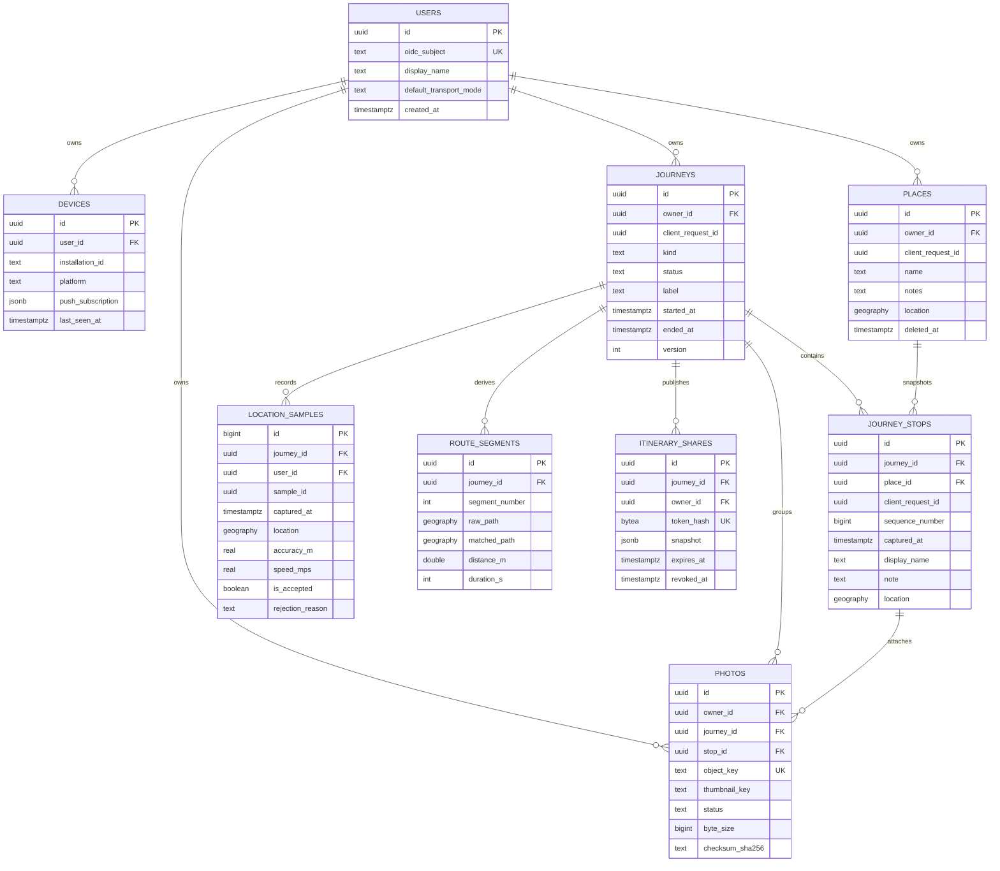

Operational tables:

| Table | Purpose |
| --- | --- |
| `background_jobs` | Available/running/dead jobs, leases, attempts, schedule, last error |
| `outbox_events` | Reserved transactional event primitive; not currently dispatched externally |
| `reverse_geocode_cache` | Rounded-coordinate Nominatim result cache |

### 9.1 Important database invariants

- A partial unique index permits only one active journey per owner.
- `(owner_id, client_request_id)` makes journey/place/photo creation idempotent.
- `(journey_id, client_request_id)` makes stop creation idempotent.
- `(journey_id, sequence_number)` preserves one canonical stop order.
- `(journey_id, sample_id)` prevents duplicated GPS samples.
- PostGIS GiST indexes support place and sample spatial queries.
- Journey status and `ended_at` are constrained to agree.
- Foreign keys cascade user/journey deletion through private data where appropriate.

## 10. Journey lifecycle

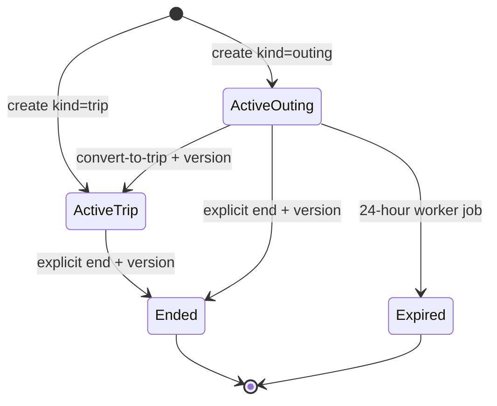

Creation starts a journey immediately. There is no persisted draft state. Creating an outing and scheduling its hour-23 warning/hour-24 expiry occur in the same transaction.

Only active journeys accept new stops or GPS points. After ending, the API still permits journey label changes and stop name/note corrections. It exposes no operation that rewrites stop order, capture time, coordinates, or route samples.

### 10.1 Journey create transaction

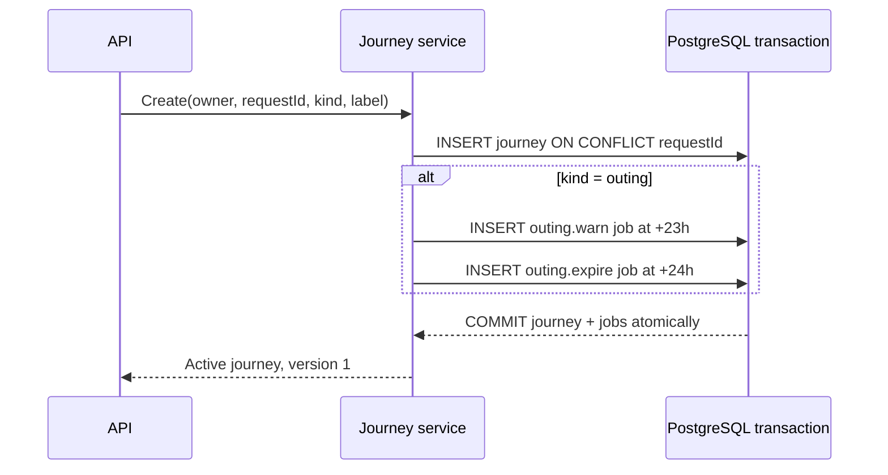

## 11. Places, timeline stops, and reverse geocoding

Standalone saved places and places captured during journeys share the owner-scoped `places` table. A journey pin atomically creates both a reusable saved place and a historical stop snapshot.

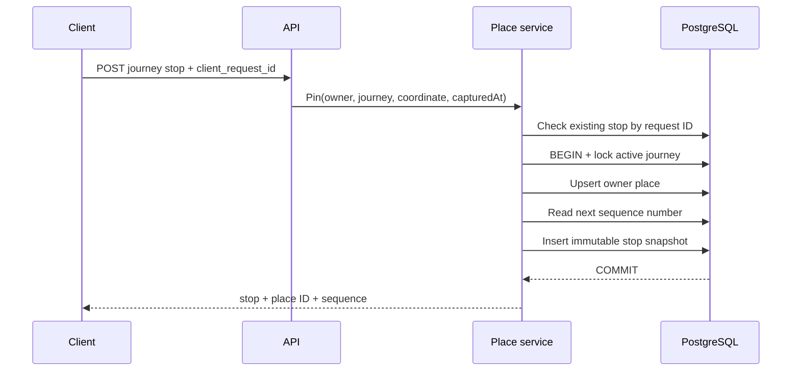

The stop copies coordinates, display name, note, and capture time. Later edits to the reusable place cannot rewrite that visit's historical coordinate.

Reverse geocoding uses rounded coordinates at five decimal places as a cache key. Cache misses are serialized to at most one Nominatim request per second per API process. The provider suggestion never silently replaces the user-entered name.

## 12. GPS ingestion and route processing

### 12.1 Ingestion path

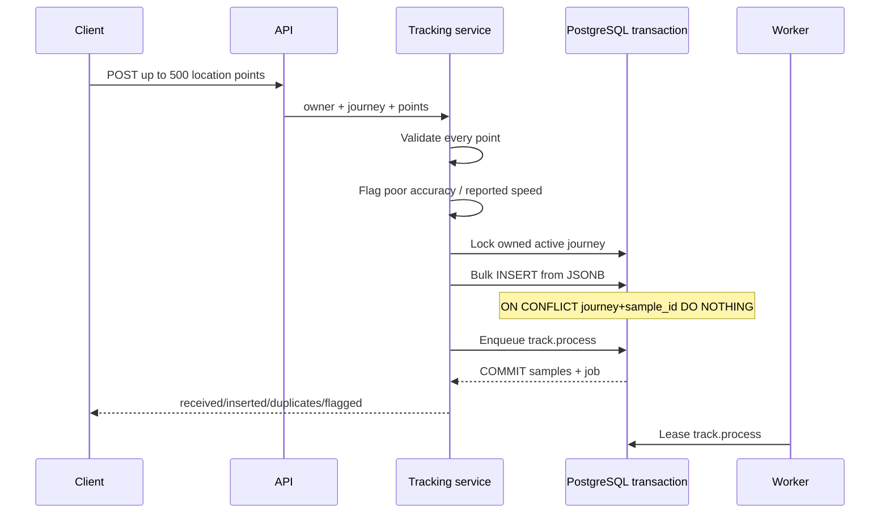

Input validation rejects the whole batch for invalid coordinates, missing UUID/time, negative accuracy/speed, heading outside 0–360, or a timestamp more than five minutes in the future. Individual samples are stored but flagged when reported accuracy exceeds 100 m or reported speed exceeds 80 m/s.

### 12.2 Cleaning algorithm

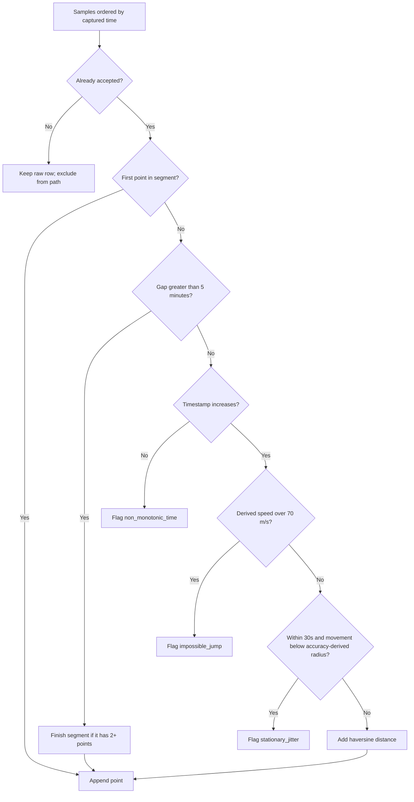

The worker preserves all raw samples. It updates quality flags, replaces derived route segments transactionally, and enqueues `track.match`. Each route segment needs at least two accepted points.

### 12.3 Map matching and route reads

The matcher calls Valhalla `/trace_attributes` with motorcycle costing and `map_snap`. A successful encoded polyline is stored separately in `matched_path`; the cleaned `raw_path` remains intact. Route reads use `COALESCE(matched_path, raw_path)`, so the cleaned line is the fallback when no match exists.

## 13. Nearby road-ranked search

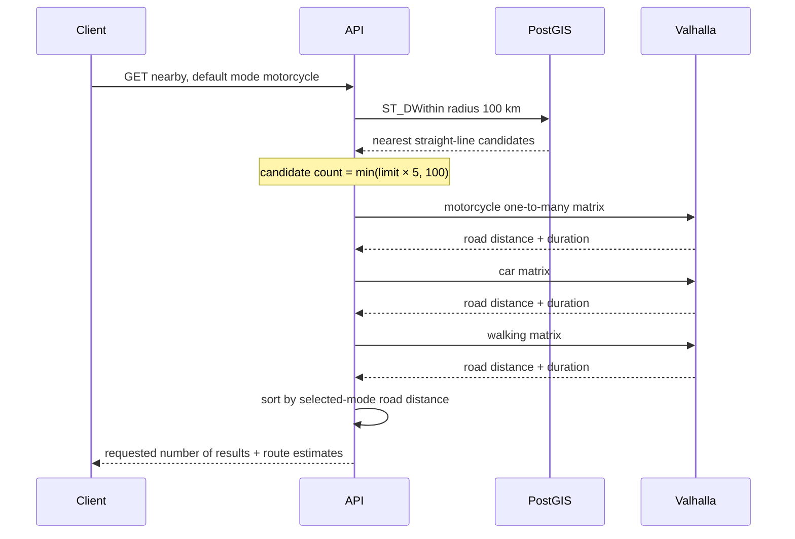

Straight-line distance is only the bounded candidate prefilter. The default successful response is ordered by motorcycle road distance, not crow-flight distance. If a non-selected mode fails, that mode is omitted; if the selected mode fails, the endpoint returns `503`.

Current constants:

| Setting | Value |
| --- | --- |
| Default result limit | 10 |
| Maximum requested results | 50 |
| Candidate radius | 100 km |
| Candidate multiplier | 5× requested limit |
| Candidate ceiling | 100 |
| Modes | motorcycle, car, walking |
| Valhalla HTTP timeout | 20 seconds per call |

The selected mode can be supplied per request. The user's stored default mode is managed through `PATCH /me`; the future client must send that preference when requesting nearby results.

## 14. Private photo lifecycle

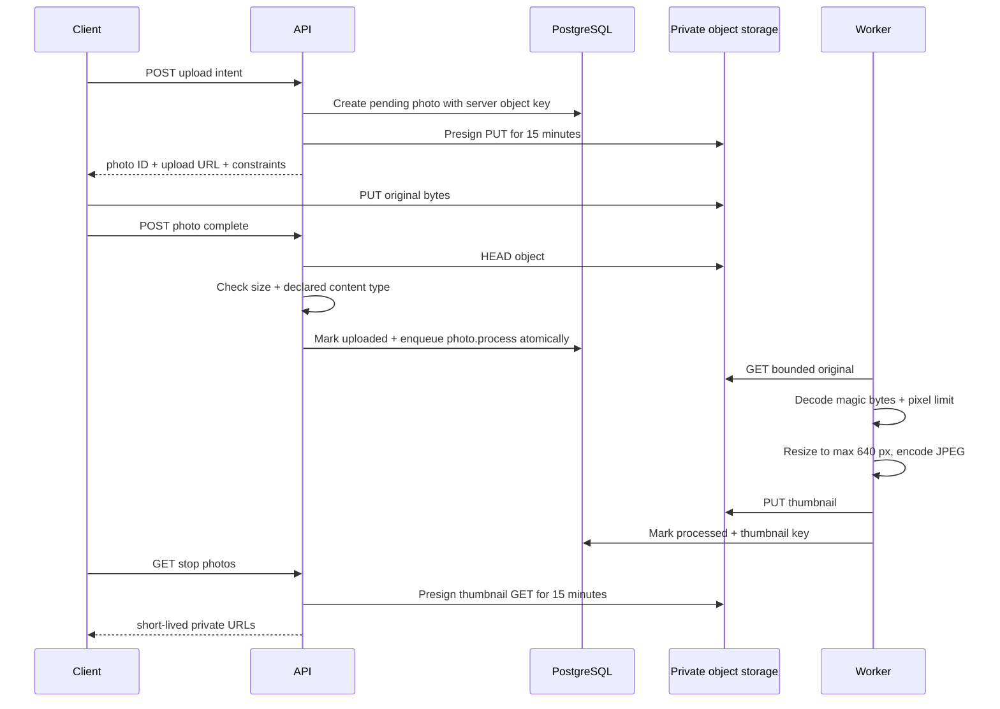

Supported input formats are JPEG, PNG, and WebP. Default maximum size is 15 MiB; decoded images are capped at 40 million pixels. Derived thumbnails discard EXIF by decoding pixels and writing a fresh JPEG.

The client may provide a SHA-256 string on completion, but the current backend records it without independently recomputing it. True checksum verification is a pre-public hardening item.

An hourly cleanup job atomically claims pending or failed photos older than 24 hours, removes the object, and deletes the row. Claiming changes state before object deletion, preventing cleanup from racing a client completion.

## 15. Public itinerary sharing

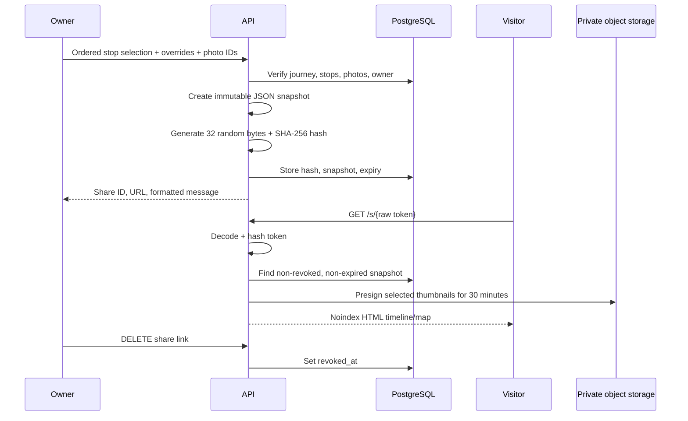

The raw public token never enters the database. Access logs normalize `/s/<token>` and public JSON paths so the token is not logged. Public HTML sets `Referrer-Policy: no-referrer` and `X-Robots-Tag: noindex, nofollow`.

Share ordering, name overrides, and note overrides exist only in the immutable snapshot. They never alter the source journey. Omitting the item list snapshots every stop in original sequence. Photos must be explicitly selected.

## 16. Durable jobs

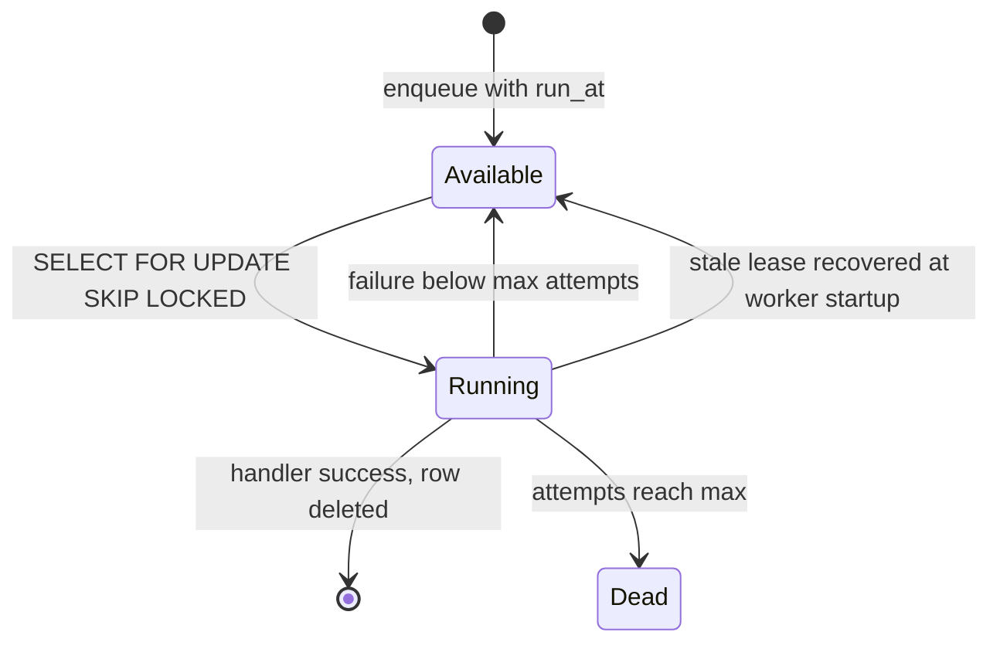

Workers poll every second and lease up to ten jobs. Attempts increment when claimed. A failure schedules exponential backoff of roughly `2^attempts` seconds, capped at 256 seconds. The last error is truncated to 2,000 characters. Jobs reaching their configured attempt limit remain in `dead` state for operator review.

Delivery is at least once. Handlers are designed to tolerate retry: route segments are replaced, photo processing recognizes `processed`, lifecycle jobs check current journey state, and job insertions use idempotency keys.

The outbox table and queries exist as an extraction seam for future external events. Current feature code enqueues background jobs directly inside the same database transaction as the triggering change.

## 17. Outing warning and expiry

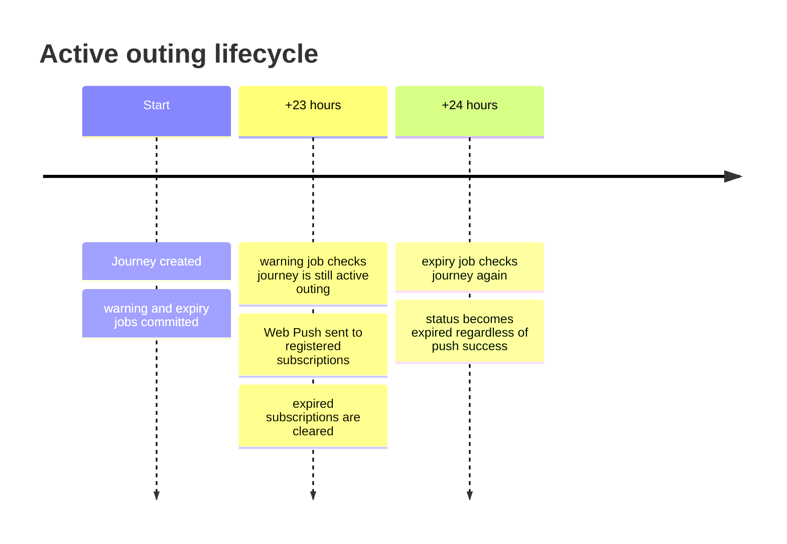

Conversion to a trip changes `kind`; the scheduled jobs remain but become harmless because both handlers re-check kind/status. Notification failure never prevents expiry.

## 18. Rate limits and dependency protection

| Endpoint | Key | Limit per API process |
| --- | --- | --- |
| Reverse geocode | Authenticated user UUID | 30/minute |
| Photo upload intent | Authenticated user UUID | 30/minute |
| Nearby road search | Authenticated user UUID | 60/minute |
| Public share JSON/HTML | Client IP | 120/minute combined |

Limiters are in-memory fixed windows with stale-bucket cleanup. Multiple API replicas each maintain their own counters; production ingress should add aggregate abuse protection. Nominatim additionally serializes cache misses to one upstream request per second per API process.

## 19. Observability and privacy

### Logs

API logs are JSON and contain method, normalized path, status, duration, request ID, trace ID, and span ID. Bodies, coordinates, bearer tokens, signed URLs, and public share tokens are not logged by routine middleware.

### Metrics

`GET /metrics` exposes Prometheus text for:

- Total requests
- Total 5xx responses
- Current in-flight requests
- Cumulative request duration

These are process-wide aggregates. Per-route histograms, database pool measures, provider health, and job backlog should be added before broad production usage.

### Traces

OpenTelemetry instruments Gin, outbound HTTP/provider calls, and job handlers. OTLP HTTP export is optional through `PINERARY_OTEL_EXPORTER_OTLP_ENDPOINT`.

### Sensitive-data rules

- Private buckets and short-lived signed URLs
- Exact owner predicate on private queries
- No request-body access logs
- Public token hashing and normalized log paths
- CSP, no-referrer, no-sniff, and frame-denial headers
- No GPS collection unless the journey is active

## 20. Configuration reference

| Variable | Used by | Purpose/default |
| --- | --- | --- |
| `PINERARY_HTTP_ADDR` | API | Listen address, default `:8080` |
| `PINERARY_ALLOWED_ORIGINS` | API | Exact comma-separated PWA origins |
| `PINERARY_DATABASE_URL` | All DB roles | PostgreSQL DSN |
| `PINERARY_AUTH_MODE` | API | `oidc` by default; `development` locally |
| `PINERARY_OIDC_ISSUER_URL` | API | OIDC discovery issuer |
| `PINERARY_OIDC_AUDIENCE` | API | Required token audience |
| `PINERARY_NOMINATIM_URL` | API | Reverse-geocoder base URL |
| `PINERARY_NOMINATIM_USER_AGENT` | API | Required identifying application/contact |
| `PINERARY_VALHALLA_URL` | API/worker | Matrix and map-matching base URL |
| `PINERARY_OBJECT_ENDPOINT` | API/worker | S3-compatible host:port |
| `PINERARY_OBJECT_ACCESS_KEY` | API/worker | Object-storage access key |
| `PINERARY_OBJECT_SECRET_KEY` | API/worker | Object-storage secret |
| `PINERARY_OBJECT_BUCKET` | API/worker | Private media bucket |
| `PINERARY_OBJECT_USE_TLS` | API/worker | Object-storage TLS flag |
| `PINERARY_MAX_PHOTO_BYTES` | API/worker | Default 15 MiB |
| `PINERARY_PUBLIC_BASE_URL` | API | Absolute origin for share URLs |
| `PINERARY_VAPID_*` | Worker | Web Push identity and keys |
| `PINERARY_OTEL_EXPORTER_OTLP_ENDPOINT` | API/worker | Optional trace collector URL |

## 21. Testing and continuous integration

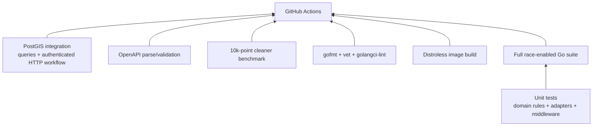

Current local verification:

- Formatting and generated `sqlc` drift: passing
- Full `go test -race ./...`: passing
- `go vet ./...`: passing
- API/worker/migration binary build: passing
- Compose configuration validation: passing
- OpenAPI validation, typed success-body checks, and Gin route/method parity: passing
- Authenticated HTTP workflow against PostGIS: passing, covering journey creation and idempotency, stop capture, GPS ingestion, ownership isolation, completion, snapshot sharing, public JSON, and public HTML
- 10,000-point cleaner benchmark: approximately 0.99 ms/op on Apple M2
- Live PostGIS/MinIO/Valhalla end-to-end run: passing on 2026-09-22, including API, worker, photo processing, GPS cleanup and map matching, motorcycle road ranking, and sharing
- Local `golangci-lint`: not installed; configured in CI

The PostGIS integration suite proves owner isolation, spatial candidate filtering, query-level idempotency, and the primary authenticated HTTP workflow. The HTTP test composes the real Gin router, authentication middleware, journey/place/tracking/sharing services, and database queries. Object storage is replaced by a test double because this no-photo scenario never reads an object; separate service tests and the live smoke run cover media behavior.

## 22. Postman interaction guide

### 22.1 Start dependencies and processes

From `backend/`:

```bash
cp .env.example .env
set -a
. ./.env
set +a
make db-up
make migrate
```

Start these in separate terminals, loading `.env` in each:

```bash
make run
```

```bash
make run-worker
```

Verify:

```text
GET http://localhost:8080/health/live
GET http://localhost:8080/health/ready
```

For private routes use:

```text
Authorization: Bearer alice
```

Import `docs/postman/Pinerary.postman_collection.json` and `docs/postman/Pinerary.local.postman_environment.json`. Collection scripts capture journey, stop, place, photo, and share IDs as requests run.

### 22.2 Feature dependencies

| Flow | Required services |
| --- | --- |
| Health, profile, journeys, places, stops | PostgreSQL/PostGIS + MinIO because API checks the bucket at startup |
| GPS ingestion | PostgreSQL; worker for derived routes |
| Reverse geocode | PostgreSQL + Nominatim/network on cache miss |
| Nearby road ranking | PostgreSQL + live Valhalla |
| Photos | PostgreSQL + MinIO + worker |
| Public sharing without photos | PostgreSQL + API |
| Public sharing with photos | PostgreSQL + MinIO |
| Outing warning | Worker + valid VAPID + browser subscription |
| Outing expiry | Worker; push configuration is not required for expiry itself |

### 22.3 Recommended request order

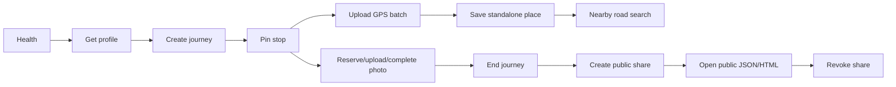

Photo PUT is the one manual Postman step: select a local JPEG/PNG/WebP file as binary body and send it to the captured `uploadUrl` with the same `Content-Type` used when reserving.

## 23. Backend sign-off and remaining hardening

The backend MVP integration gate is closed: the OpenAPI contract is typed and route-checked, and the primary HTTP workflow is exercised against PostGIS in CI. PWA work can begin against this contract. The following are production or pre-public hardening tasks, not blockers for frontend development:

| Priority | Item | Why it matters |
| --- | --- | --- |
| P1 | Recompute and verify photo SHA-256 server-side or remove the checksum claim | The value is currently stored but not independently verified |
| P1 | Decide production OIDC provider and account-recovery flow | Development auth is intentionally unsafe outside local development |
| P1 | Configure production S3 CORS, TLS ingress, secrets, backups, and monitoring | Deployment work rather than missing domain code |
| Pre-public | Account export/deletion, audit events, retention policy, broader load/security tests | Privacy and operational readiness for users beyond the initial development group |

Frontend integration may reveal additive contract refinements. Existing fields and semantics should now be treated as stable; breaking API changes require an explicit contract/versioning decision.

## 24. Design trade-offs and interview discussion

### Why a modular monolith?

The product has asynchronous and geospatial complexity but a very small initial user base. One codebase and database keep transactions, authorization, migrations, local setup, and debugging manageable. Package boundaries and provider interfaces preserve an extraction path without paying distributed-system costs prematurely.

### Why Gin rather than Fiber?

Gin stays on the standard `net/http` ecosystem and has familiar middleware/test tooling. Database, object-storage, and routing latency dominate this workload; synthetic router throughput is not the limiting factor.

### Why PostgreSQL jobs rather than Kafka or Redis?

Journey creation, GPS ingestion, photo completion, and lifecycle scheduling need the domain change and job to commit together. PostgreSQL provides that atomicity and `SKIP LOCKED` leasing with no extra service. A dedicated broker becomes useful only after measured queue contention or independent service scaling.

### Why PostGIS before Valhalla?

Calling a route matrix for every saved location is expensive. PostGIS cheaply reduces the search to plausible candidates; Valhalla then provides the user-visible road distance/time. The shortlist is an optimization, while road cost remains the ranking rule.

### Why preserve raw GPS points?

GPS filtering is heuristic. Keeping raw append-only samples makes quality decisions auditable and permits reprocessing with improved rules. Cleaned and map-matched lines are derived projections, not replacements for historical input.

### Why direct-to-object-storage uploads?

Photo bytes avoid the API process, reducing memory, bandwidth, and timeout pressure. The API retains control by generating unpredictable owner-scoped keys, short-lived PUT URLs, metadata rows, completion validation, and private short-lived reads.

### Why immutable share snapshots?

A public itinerary should not change because the owner later renames/reorders private data. Snapshots provide stable presentation, share-only ordering, independent expiry/revocation, and a clear privacy boundary while preserving the journey's recorded truth.

## 25. Suggested code-reading order

For a new engineer, this sequence builds understanding without starting in generated SQL:

1. `backend/cmd/api/main.go` — composition and dependencies.
2. `backend/internal/httpapi/router.go` — complete surface area.
3. `backend/internal/httpapi/openapi.yaml` — request vocabulary.
4. `backend/internal/database/migrations/00001_initial_schema.sql` — durable model.
5. `backend/internal/journeys/model.go` and `service.go` — lifecycle conventions.
6. `backend/internal/places/service.go` — ownership, transactions, timeline snapshots.
7. `backend/internal/tracking/service.go`, `cleaner.go`, `processor.go`, `matcher.go` — the deepest workflow.
8. `backend/internal/nearby/service.go` and `routing/` — two-stage geospatial search.
9. `backend/internal/media/service.go`, `processor.go`, `cleanup.go` — object lifecycle.
10. `backend/internal/sharing/service.go` and `httpapi/share_page.html` — public snapshot model.
11. `backend/internal/jobs/runner.go` and `cmd/worker/main.go` — asynchronous reliability.
12. `backend/internal/database/queries/*.sql` — exact authorization and persistence behaviour.

Generated files under `internal/database/dbgen` should be read only when tracing a generated type or parameter. Their source of truth is the corresponding SQL query or migration.
