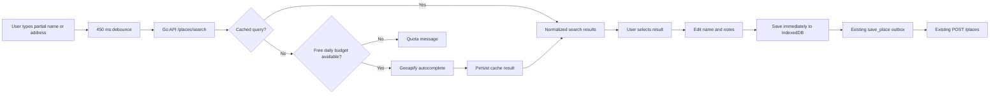

# Advance Place Search Implementation Plan

| Field | Value |
| --- | --- |
| Status | Implemented; live provider smoke test requires a Geoapify key |
| Last updated | 2026-09-27 |
| Scope | Search real-world places and save them before visiting |
| Suggestion provider | Geoapify Address Autocomplete, accessed only through the Go API |
| Reverse-geocoding provider | Public Nominatim, retained for current-location naming |
| Cost target | $0; application-enforced usage budget below the provider's free allowance |

## 1. Problem

The Places page currently has two capabilities:

1. **Pin current place** captures the device's current coordinates and reverse-geocodes a suggested name.
2. **Search your saved places** only filters records that already exist in IndexedDB.

It cannot search for a new hotel, restaurant, landmark, or address by name. Consequently, the product does not yet satisfy the requirement to collect places before a trip.

The existing filter must remain, but it must be visually and behaviorally distinct from a new real-world place search.

## 2. Outcome

A signed-in user can type a partial place name or address, inspect up to ten matching suggestions, select one, edit its name and notes, and save it to the existing offline-first place library. Exact spelling or the complete name is not required.

Saving a selected result uses the existing place model and outbox. No new ownership model, canonical global place table, or journey-planning model is introduced.

Implementation was completed in the planned two commits: the first adds the budgeted Go API integration, and the second adds the PWA discovery, preview, and offline-first save flow. Automated backend and PWA verification passes without contacting public providers. The manual Geoapify smoke test remains an operator step after configuring a key.



## 3. Product decisions

| Question | Decision | Reason |
| --- | --- | --- |
| Is the current field a web place search? | No; relabel it as a saved-place filter | Avoids implying a network search |
| How is a new search initiated? | Automatically after 3 characters and a 450 ms typing pause; Enter can request immediately | Provides useful suggestions while bounding request volume |
| Which provider handles suggestions? | Geoapify Address Autocomplete | It explicitly supports incomplete address/place suggestions on a free tier |
| Which provider handles current GPS coordinates? | Existing Nominatim reverse geocoding | Avoids unnecessary Geoapify credits and reuses the working implementation |
| Where are providers called? | Go backend only | Centralizes secrets, budgets, caching, error handling, and provider replacement |
| Is a provider account or API key required? | A free Geoapify account and API key are required | The free tier currently requires no credit card and supplies 3,000 credits/day |
| Is search restricted to India? | No | The application is for travel and must also find destinations outside India |
| Does current location affect results? | Not in the first version | Advance searches are often for another city; users can include the city/area in the text |
| How many results are returned? | Five by default; ten maximum | Enough choice without encouraging exploratory/bulk querying |
| Can a search result be renamed? | Yes, before saving | The user's label remains authoritative |
| Does saving require the network? | The search does; saving the selected result does not | Once a result is selected, the existing IndexedDB/outbox path provides offline durability |
| Are search history and suggestions stored for the user? | No | A shared hashed cache reduces provider calls, but no user-visible or user-owned search history is created |
| Are provider records deduplicated across users? | No | The existing owner-scoped place model remains unchanged; canonical place deduplication is a separate future decision |

### 3.1 Provider account setup

Before enabling live suggestions:

1. Create one free Geoapify account and a Pinerary project; no payment card is required for the current free plan.
2. Create separate development and production API keys when possible so either can be rotated independently.
3. Put the development key only in the ignored `backend/.env`; put the production key in the deployment secret store.
4. Never add a Geoapify key to a `NEXT_PUBLIC_*` variable or a committed file.
5. After the production server has a stable outbound IP, restrict the production key to that IP in Geoapify.
6. Review the provider dashboard and the application's daily-usage metric during smoke testing.

## 4. User experience

### 4.1 Places page structure

The page will contain three clearly separated actions:

1. **Search for a new place** — network-backed discovery.
2. **Pin current place** — GPS capture at the user's present location.
3. **Filter saved places** — local filtering of the user's existing library.

The new search area appears above the saved library:

```text
Search for a place or address
Bhappe Da Hot...

Suggestions
┌──────────────────────────────────────────────────────────┐
│ Bhappe Da Hotel                                         │
│ Karol Bagh, New Delhi, Delhi, India                     │
│                                                   [Add]  │
└──────────────────────────────────────────────────────────┘

Your saved places
Filter saved places...
```

### 4.2 Search interaction

- Trim the query and require 3–200 Unicode characters.
- Request suggestions after 450 ms without further typing; Enter requests immediately.
- Do not call the API for fewer than three meaningful characters.
- Cancel or ignore superseded requests and prevent duplicate in-flight queries.
- Show a loading state without removing the user's query.
- Replace prior results only after a successful new response.
- Show a specific empty state when no results match.
- Show retryable messages for provider/network failures, rate limits, and exhausted daily allowance.
- Display `Powered by Geoapify` and `© OpenStreetMap contributors` near the suggestions and saved-place library.
- Do not require geolocation permission for advance search.

### 4.3 Selecting and saving

Selecting **Add** opens a confirmation form containing:

- a marker/map preview at the returned coordinates;
- editable name, prefilled from the result;
- full provider address as contextual read-only text;
- editable notes;
- Save and Cancel actions.

Save calls the existing `saveStandalonePlace(name, notes, coordinates)` function. This immediately creates the local place and enqueues the existing `save_place` operation. The new item appears in the library even if connectivity disappears between search and save.

The provider address is not automatically copied into notes. The user decides what personal information to retain.

### 4.4 Offline behavior

When offline:

- searching for a previously unknown real-world place is unavailable;
- the UI explains that discovery requires a connection;
- filtering, viewing, and saving already selected/local places continue to work;
- queued saves synchronize through the existing outbox after reconnection.

The service worker must not cache authenticated search API responses. Server-side caching supplies reuse without exposing one user's response through browser runtime caches.

## 5. API contract

Add this authenticated endpoint:

```http
GET /api/v1/places/search?q=Bhappe%20Da%20Hot&limit=5
Authorization: Bearer <access-token>
Accept-Language: en-IN,en;q=0.9
```

Parameters:

| Name | Required | Validation | Meaning |
| --- | --- | --- | --- |
| `q` | Yes | Trimmed length 3–200 | Free-form place name or address |
| `limit` | No | Integer 1–10; default 5 | Maximum returned matches |

Example response:

```json
{
  "items": [
    {
      "result_id": "node:123456789",
      "name": "Bhappe Da Hotel",
      "address": "Karol Bagh, New Delhi, Delhi, India",
      "latitude": 28.6512,
      "longitude": 77.1905,
      "category": "amenity",
      "type": "restaurant",
      "bounding_box": {
        "south": 28.6511,
        "west": 77.1904,
        "north": 28.6513,
        "east": 77.1906
      }
    }
  ],
  "attribution": {
    "provider": "Powered by Geoapify",
    "provider_url": "https://www.geoapify.com/",
    "data": "© OpenStreetMap contributors",
    "data_url": "https://www.openstreetmap.org/copyright"
  }
}
```

Contract rules:

- `result_id` is an opaque Geoapify result/place key used only by the suggestion UI; it is not a Pinerary place ID.
- The backend exposes only fields used by the client, not the complete provider payload.
- Coordinates and bounding-box values are validated before returning them.
- Empty provider results return `200` with an empty `items` array.
- Invalid query input returns `400 invalid_search_query`.
- Per-user throttling returns `429 rate_limited` with `Retry-After`.
- Exhausting Pinerary's configured daily provider-call budget returns `429 place_search_quota_exhausted` with a retry time for the next UTC allowance window.
- Provider timeout or failure returns `503 place_search_unavailable`; no fake or straight-line result is substituted.
- The query string and provider response must not appear in routine logs or traces.

Update `backend/internal/httpapi/openapi.yaml` first, then regenerate `web/src/lib/api/schema.d.ts`. Add the request to the Postman collection after the endpoint is implemented.

## 6. Backend design

### 6.1 Provider interface

Keep the existing `ReverseGeocoder` boundary for Nominatim and introduce a separate suggestion boundary. The split makes the two-provider decision explicit and lets either provider change independently:

```go
type SuggestInput struct {
    Query          string
    Limit          int
    AcceptLanguage string
}

type Suggestion struct {
    ResultID   string
    Name       string
    Address    string
    Latitude   float64
    Longitude  float64
    Category   string
    Type       string
    BoundingBox BoundingBox
}

type PlaceSuggester interface {
    Suggest(context.Context, SuggestInput) ([]Suggestion, error)
}
```

The exact Go type names may follow existing package conventions, but the HTTP handler must depend on this interface and the Geoapify JSON model must remain inside the provider adapter. This is an interactive request/response feature; it does not use the background worker.

### 6.2 Geoapify request and configuration

The provider adapter calls `https://api.geoapify.com/v1/geocode/autocomplete` with:

- `format=json`;
- `text=<partial query>`;
- `limit=1..10`;
- `lang=<validated preferred language>` when present;
- `apiKey=<server-side secret>`.

Do not apply a country filter: travel searches must remain global. Do not add an automatic current-location bias in the first version because the user may be planning another city. A later UI can add an explicit search area whose value becomes part of the cache key.

Add these environment variables:

| Variable | Behavior |
| --- | --- |
| `PINERARY_PLACE_SEARCH_PROVIDER` | `geoapify` when suggestion search is enabled |
| `PINERARY_GEOAPIFY_API_KEY` | Required secret; never sent to the PWA |
| `PINERARY_GEOAPIFY_BASE_URL` | Defaults to the official endpoint; overrideable for tests/provider gateways |
| `PINERARY_GEOAPIFY_DAILY_BUDGET` | Defaults to 2,500 provider calls per UTC day |

Production startup fails fast when the configured suggestion provider lacks its API key. Unit and integration tests use a stub HTTP server and never need a real key. The outgoing request URL contains the API key, so logs, error messages, and OpenTelemetry URL attributes must omit/redact its query string.

Nominatim remains unchanged for `GET /places/reverse-geocode`; Geoapify is not called when naming a captured GPS point.

### 6.3 Persistent cache

Add a `place_search_cache` table:

| Column | Purpose |
| --- | --- |
| `cache_key` | SHA-256 of normalized query, language and limit |
| `results` | Normalized Pinerary result array as `jsonb` |
| `result_count` | Allows cheap empty-result inspection |
| `expires_at` | Freshness boundary |
| `created_at`, `updated_at` | Operations and cleanup |

Cache behavior:

- normalize surrounding/repeated whitespace and case for the key while forwarding the user's trimmed text;
- never persist the raw query itself;
- cache successful non-empty suggestions for seven days;
- cache successful empty results for one hour to prevent repeated misses;
- treat an expired entry as a miss and replace it after a successful provider response;
- if refresh fails, return the provider error rather than serving indefinitely stale data in the first version;
- add a bounded cleanup query/job only if observed cache growth justifies it; the initial dataset will be small.

This cache is provider infrastructure, not user search history. It has no `owner_id` and is never exposed as a list.

Add a small `provider_daily_usage` table with a `(provider, usage_date)` primary key and an atomic counter. A cache miss reserves one Geoapify call before contacting the provider. This makes the application stop below the free allowance even after an API restart.

### 6.4 Rate limits, free-tier budget, and deployment shape

- Apply an endpoint limit of 30 suggestion requests per user per minute; cache hits still count to discourage automated enumeration.
- Apply a shared in-process Geoapify limiter of at most four upstream calls per second, leaving headroom below the current free-plan ceiling of five requests per second.
- Reserve at most 2,500 Geoapify calls per UTC day by default, leaving 500 credits of headroom below the current 3,000-credit free allowance.
- Count only actual provider calls against the daily budget; cache hits cost no Geoapify credit.
- Return `place_search_quota_exhausted` until the next UTC day when the application budget is reached.
- Read limits from configuration so policy/pricing changes do not require client releases.
- The persistent daily counter protects the budget across API restarts and future replicas. Before horizontal scaling, use PostgreSQL-backed coordination or a gateway limiter for the per-second ceiling as well.
- Alert at 70%, 85%, and 95% of the configured daily budget before broader public use.

### 6.5 Error mapping

Introduce typed/sentinel geocoding errors so the handler can distinguish:

| Condition | HTTP result |
| --- | --- |
| Invalid local input | `400 invalid_search_query` |
| User endpoint limit reached | `429 rate_limited` |
| Application daily provider budget reached | `429 place_search_quota_exhausted` |
| Provider timeout, `429`, or `5xx` | `503 place_search_unavailable` |
| Malformed provider response | `503 place_search_unavailable` plus internal error telemetry |
| Database/cache failure | Existing internal error envelope |

Do not expose upstream response bodies to the client.

## 7. PWA design

### 7.1 API and types

- Regenerate the OpenAPI TypeScript schema.
- Add `searchPlaces(query, limit)` to `web/src/lib/api/client.ts`.
- Use the generated result type rather than a handwritten duplicate.
- Do not store search results in IndexedDB; only the selected saved place belongs there.

### 7.2 Component structure

Extract the network-backed flow from the page so it remains testable:

```text
places/page.tsx
├── PlaceAutocomplete
├── PlaceSuggestionList
├── SaveSearchResultDialog
├── PinCurrentPlaceDialog (existing behavior)
└── SavedPlaceLibrary
    └── local filter
```

Components may remain in one feature file if the implementation is still readable; the structure describes responsibilities rather than requiring architecture-only files.

### 7.3 State model

Use explicit UI state rather than overloading the saved-place filter:

```text
idle -> too-short
     -> debounce -> loading -> success(suggestions)
                           -> empty
                           -> error(retryable message)

success -> result selected -> save dialog -> saved
```

Abort an in-flight request when the text changes. Also compare a monotonically increasing request ID before applying results so a late response can never replace newer suggestions.

### 7.4 Accessibility and mobile behavior

- Implement the input/list relationship with accessible combobox and listbox semantics.
- Support Arrow Up/Down, Enter, Escape, pointer selection, and a clear button.
- Give suggestions keyboard-focusable selection controls with descriptive labels.
- Announce loading, empty, and error states through an appropriate live region.
- Move focus to the dialog heading after selection and return it to the triggering result after cancellation.
- Keep search and save controls usable at narrow mobile widths and with the on-screen keyboard visible.
- Avoid placing critical actions only inside map markers.

## 8. Security and privacy

- Keep the endpoint authenticated to prevent the application becoming an anonymous geocoding proxy.
- Continue validating Auth0 tokens before any provider/cache access.
- Bound query length, result count, upstream body size, and request timeout.
- Build provider URLs through `net/url`; never concatenate untrusted query text.
- Keep the Geoapify key only in backend secret configuration; never expose it in OpenAPI, API responses, PWA environment variables, logs, metrics, traces, or errors.
- Send no Auth0 subject, Pinerary user ID, notes, or saved-place data to Geoapify. Only the partial query, limit, and preferred language are sent.
- Explain in the UI/privacy documentation that typed search text is sent to Geoapify after the debounce.
- Preserve existing inbound logging rules: normalized route only, with no query string or coordinates. Sanitize outbound telemetry because Geoapify authenticates with a URL query parameter.
- Display linked `Powered by Geoapify` and `© OpenStreetMap contributors` attribution with suggestions and wherever saved provider-derived location data is reused.

## 9. Testing plan

### 9.1 Backend unit tests

- Geoapify request contains encoded partial text, bounded limit, language, format, and the configured API key.
- Provider response maps into the normalized result shape.
- Missing names fall back safely to the first formatted-address component.
- Invalid coordinates, bounding boxes, oversized bodies, invalid JSON, timeout, `429`, and `5xx` are rejected.
- The provider limiter stays below the configured requests-per-second ceiling.
- The API key and raw provider bodies never appear in logs, traces, or returned errors.

### 9.2 Backend service and handler tests

- Query validation and normalization.
- Fresh cache hit avoids the provider.
- Cache key varies by query, language, and limit without storing raw query text.
- Empty results use the shorter cache lifetime.
- Expired cache refreshes.
- Endpoint requires authentication.
- `limit` defaults to five and cannot exceed ten.
- Response matches OpenAPI and rate limiting returns `Retry-After`.
- Daily usage reservation is atomic and survives API restart/concurrency.
- Cache hits do not consume the daily provider budget.
- Budget exhaustion prevents the provider call and reports the next reset.

### 9.3 Database/integration tests

- Migration up/down succeeds.
- Cache upsert/read/expiry queries work against PostgreSQL.
- An authenticated HTTP search through a stub provider returns normalized results.
- Saving one returned coordinate through the existing `POST /places` path produces a user-owned place.

No automated test should call Geoapify or the public Nominatim service.

### 9.4 PWA tests

- Fewer than three characters do not issue a request.
- Typing several characters within the debounce window issues one request for the latest text.
- Enter bypasses the remaining debounce without duplicating a request.
- Superseded responses cannot replace current suggestions.
- Loading, empty, offline, rate-limit, quota, and provider-error states render correctly.
- Selecting a result pre-fills the save dialog.
- Edited name and notes are persisted through `saveStandalonePlace`.
- Saved-place filtering remains local and independent of the discovery query.
- Search responses are not written to IndexedDB.

### 9.5 Manual smoke test

1. Sign in through Auth0.
2. Search `Bhappe Da Hotel, New Delhi` and confirm useful matches.
3. Select one, rename it, add notes, and save it.
4. Confirm it appears immediately in the saved library.
5. Confirm `POST /places` completes and the database contains the authenticated owner ID.
6. Reload and confirm the saved place remains.
7. Go offline and confirm the saved place is filterable while discovery is disabled.
8. Restore connectivity and confirm queued saves synchronize.
9. Type a partial/misspelled name slowly and verify useful suggestions update after each pause.
10. Search the same final query again and verify the backend cache avoids another provider call.
11. Verify linked Geoapify and OpenStreetMap attribution is visible.

## 10. Implementation sequence and commits

Keep this feature to two implementation commits.

### Commit 1 — `feat(places): add budgeted Geoapify suggestions`

- Add the OpenAPI endpoint and schemas.
- Add the provider-neutral suggestion interface and Geoapify adapter while retaining Nominatim reverse geocoding.
- Add secret configuration, outbound telemetry redaction, provider throttling, and the persisted daily free-tier budget.
- Add the place-search cache and provider-usage migrations/sqlc queries.
- Add authentication, validation, endpoint rate limiting, and error mapping.
- Add unit, contract, and integration tests.
- Update the API handbook and Postman collection.

Verification:

```bash
cd backend
make generate
make fmt-check
make test
make vet
make lint
```

### Commit 2 — `feat(pwa): search and save places in advance`

- Regenerate the TypeScript API schema.
- Add the PWA API client method.
- Separate discovery search from local saved-place filtering.
- Add the debounced accessible suggestion list plus confirmation, offline, loading, empty, quota, and failure states.
- Reuse the existing offline-first save/outbox path.
- Add required Geoapify and OpenStreetMap attribution.
- Add component and interaction tests.
- Update PWA and architecture documentation.

Verification:

```bash
cd web
npm run generate:api
npm run lint
npm run typecheck
npm test
npm run build
```

After both commits, run the manual smoke test with PostgreSQL/PostGIS, MinIO, API, worker, and PWA. Valhalla is not required for place discovery itself, but remains required to calculate road distance to the newly saved place.

## 11. Acceptance criteria

The feature is complete only when:

- a user can find a new real-world place by submitted name/address;
- partial names produce suggestions after a short typing pause;
- rapid typing is debounced and stale provider responses are ignored;
- search results provide a meaningful name, address, and validated coordinates;
- a selected result can be renamed, annotated, and saved;
- the saved place immediately enters the offline-first library and later synchronizes;
- the original local filter still searches saved names and notes;
- provider/cache errors do not lose existing places or queued changes;
- linked Geoapify/OpenStreetMap attribution and privacy behavior are visible/documented;
- the Geoapify key is server-only and absent from logs, traces, errors, and browser assets;
- provider calls stop below the configured free daily allowance;
- automated tests never depend on the public provider;
- all backend and PWA verification commands pass.

## 12. Explicit non-goals

- Suggestions before three meaningful characters
- Trip-planning suggestions or route optimization
- Search history or personalized ranking
- Cross-user canonical place deduplication
- Reviews, opening hours, menus, or rich commercial-place metadata
- Complete offline POI/address search
- Self-hosting Nominatim, Photon, or another autocomplete provider in the MVP
- Adding a selected place directly to a future itinerary plan
- Automatically converting a searched/saved place into a journey timeline stop

## 13. Provider exit strategy

The PWA calls only Pinerary's stable `/places/search` contract. The Go adapter owns Geoapify-specific authentication and response formats, while Nominatim remains behind the independent reverse-geocoding interface. If Geoapify's quota, pricing, or terms no longer fit the application, the suggestion adapter can move to LocationIQ, hosted Photon, or a self-hosted service without changing the PWA save flow.

## 14. References

- [Geoapify Address Autocomplete API](https://apidocs.geoapify.com/docs/geocoding/address-autocomplete/)
- [Geoapify autocomplete UX guidance](https://apidocs.geoapify.com/how-to/addresses/add-address-autocomplete/)
- [Geoapify pricing](https://www.geoapify.com/pricing/)
- [Geoapify terms and attribution requirements](https://www.geoapify.com/terms-and-conditions/)
- [Nominatim Usage Policy](https://operations.osmfoundation.org/policies/nominatim/)
- [OpenStreetMap copyright and attribution](https://www.openstreetmap.org/copyright)
