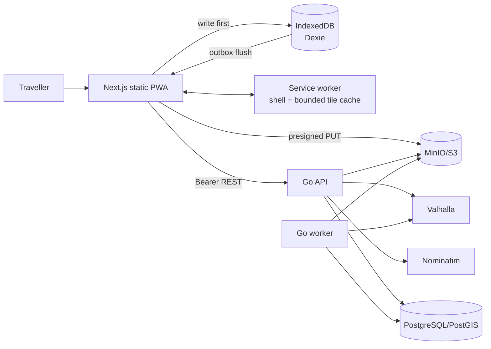
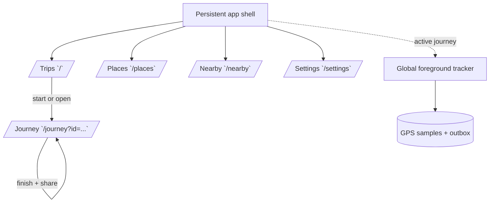
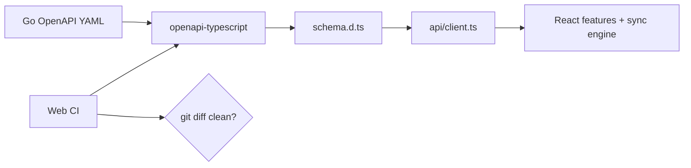
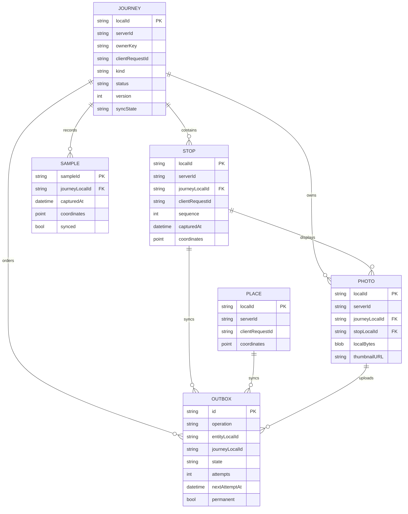
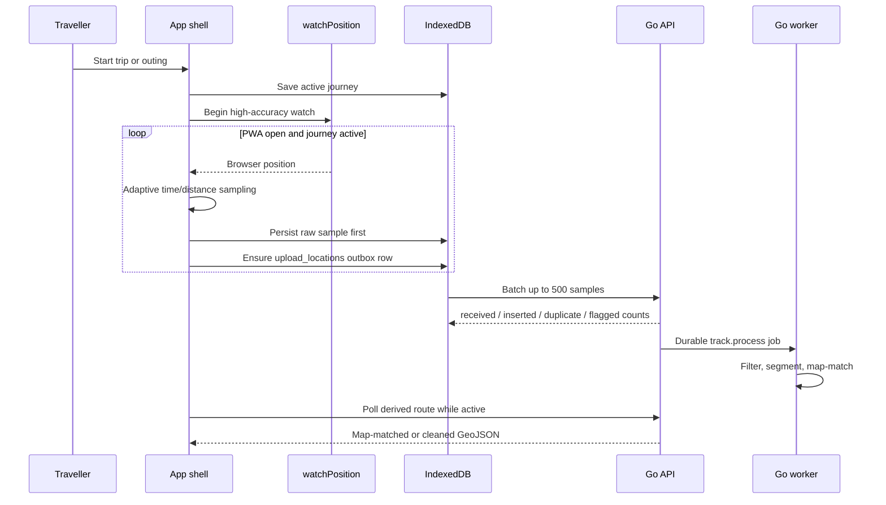
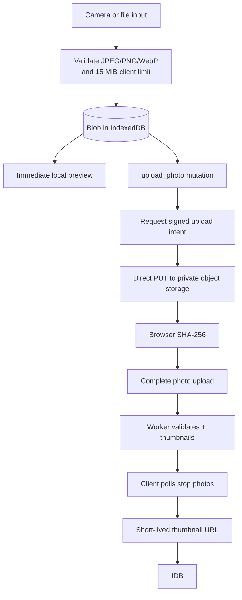
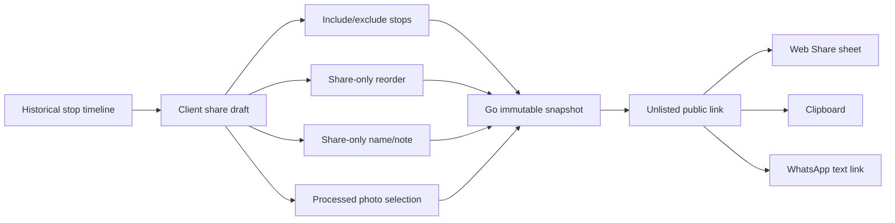
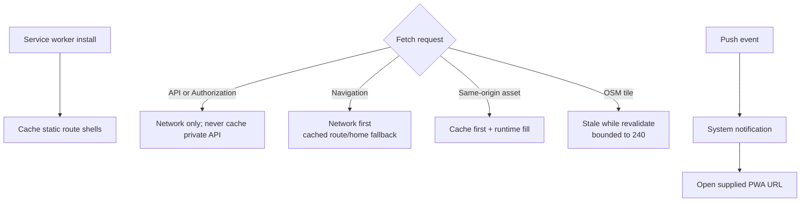
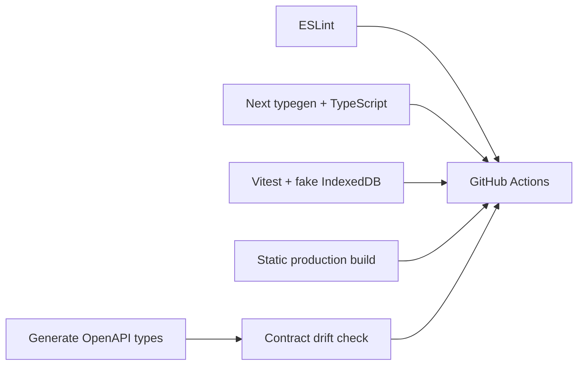

# Pinerary PWA — Detailed Design and Repository Guide

| Field | Value |
| --- | --- |
| Document type | As-built client design and code-reading guide |
| Client status | MVP feature baseline implemented; real-device hardening pending |
| Last reviewed | 2026-09-23 |
| Framework | Next.js 16 App Router, React 19, TypeScript |
| Delivery | Static export and installable PWA; no Node production server |
| Local persistence | IndexedDB through Dexie |
| Maps | MapLibre GL JS with OpenStreetMap raster tiles during development |
| API contract | Types generated from `backend/internal/httpapi/openapi.yaml` |

## 1. Executive summary and readiness

The PWA is a working client baseline rather than a visual-only prototype. It provides journeys and outings, chronological stop capture, foreground GPS recording, offline persistence, delayed synchronization, queued photos, saved places, motorcycle-first road search, immutable journey completion, share-only itinerary editing, native/WhatsApp sharing, optional Web Push registration, and an installable static app shell.

All authoritative business operations still belong to the Go API. The PWA optimistically records data in IndexedDB and uses an outbox to deliver mutations when the network is available. This makes capture resilient to short connectivity loss without creating a second business backend in Next.js.

| Question | Answer |
| --- | --- |
| Does the client build as static files? | Yes. `npm run build` generates `web/out/` without a Node server. |
| Does it work offline? | Core shell, journeys, pins, GPS samples, place capture, and photo queuing do. Road routing, reverse geocoding, public-link creation, and uncached map tiles require connectivity. |
| Is route tracking automatic? | Yes while an active journey exists and the PWA remains open in the foreground. Browsers may suspend it in the background or on screen lock. |
| Is it installable? | Yes. It has a manifest, application icons, static routes, and a service worker. Production installation requires HTTPS. |
| Does it call the real backend? | Yes. The client is generated against the OpenAPI contract and calls the Go API directly with bearer authentication. |
| Is it production-ready? | Not yet. Real iOS/Android browser testing, production OIDC, sync-conflict UX, security review, and operational deployment remain. |
| Is Capacitor included? | No. It remains the final Android-only phase. |

## 2. Runtime architecture



The deployed PWA consists only of HTML, CSS, JavaScript, fonts, icons, a manifest, and a service worker. Browser calls go to the Go API origin configured by `NEXT_PUBLIC_API_BASE_URL`. The backend must allow the exact PWA origin through CORS.

### 2.1 Ownership boundary

| PWA owns | Go backend owns |
| --- | --- |
| UI state and navigation | Authentication verification and user provisioning |
| Browser permissions and foreground geolocation | Authoritative journey transitions |
| IndexedDB cache and mutation outbox | Ownership enforcement |
| Optimistic local rendering | PostGIS queries and road ranking |
| Service-worker caching | GPS cleanup and map matching |
| Native share-sheet invocation | Private object keys and media processing |
| Direct upload using a signed URL | Immutable public snapshot creation |

There are no Next.js API routes, Server Actions, database credentials, provider secrets, or privileged map calls.

## 3. Page and navigation model



Dynamic journey identifiers are query parameters rather than App Router dynamic segments. Static export cannot build unknown dynamic routes without `generateStaticParams`; `/journey?id=...` preserves fully static hosting while still supporting arbitrary locally generated IDs.

The desktop layout uses a fixed navigation rail. Widths below 900 pixels use a safe-area-aware bottom navigation bar. All primary controls are designed for touch and use at least 45-pixel action height.

## 4. Repository map

```text
web/
├── public/
│   ├── icons/                 PWA application and maskable SVG icons
│   ├── manifest.webmanifest   Install metadata
│   └── sw.js                  Offline shell, runtime asset, tile, and push worker
├── src/
│   ├── app/
│   │   ├── page.tsx           Journey home/start flow
│   │   ├── journey/page.tsx   Route, timeline, capture, finish, share
│   │   ├── places/page.tsx    Standalone saved-place library
│   │   ├── nearby/page.tsx    Road-ranked and offline approximate search
│   │   ├── settings/page.tsx  Connection, profile, push, sync, reset
│   │   ├── layout.tsx         Metadata, fonts, providers, app shell
│   │   └── globals.css        Responsive design system
│   ├── components/
│   │   ├── app-provider.tsx   Network and sync orchestration
│   │   ├── app-shell.tsx      Navigation and cross-route tracker host
│   │   ├── foreground-tracker.tsx
│   │   ├── journey-map.tsx
│   │   ├── photo-strip.tsx
│   │   ├── share-composer.tsx
│   │   ├── timeline-stop.tsx
│   │   └── ui.tsx
│   ├── lib/
│   │   ├── api/client.ts      Typed Go API facade
│   │   ├── api/schema.d.ts    Generated OpenAPI types
│   │   ├── config.ts          Browser API URL/token/device identity
│   │   ├── db.ts              Dexie schema
│   │   ├── repository.ts      Local-first commands
│   │   ├── sync.ts            Outbox dispatcher and remote pull
│   │   ├── geo.ts             Distance, duration, geolocation helpers
│   │   └── types.ts           Local persistence types
│   └── test/setup.ts          Fake IndexedDB test environment
├── next.config.ts             Static export configuration
├── vitest.config.ts
├── package.json
└── .env.example
```

## 5. Build and rendering decisions

### 5.1 Static export

`next.config.ts` sets `output: "export"`, trailing slashes, and unoptimized images. `next build` prerenders these routes:

- `/`
- `/journey/`
- `/places/`
- `/nearby/`
- `/settings/`

Client components access IndexedDB, geolocation, service workers, push, camera/file inputs, local storage, MapLibre, and the remote API after hydration. The public itinerary itself remains Go-rendered at `/s/{token}` so link previews do not require JavaScript or a Next.js runtime.

### 5.2 Self-hosted fonts

DM Sans and Fraunces are bundled through Fontsource. Production and CI builds do not contact Google Fonts, and the installed PWA retains its typography offline.

### 5.3 API type generation



`npm run generate:api` regenerates `schema.d.ts`. CI fails when the committed type file differs from the backend contract. `openapi-fetch` then type-checks paths, path/query parameters, request bodies, and response data.

## 6. IndexedDB model



Local IDs are UUIDs created before any network call. Server IDs are added after synchronization. This lets an offline stop refer to an offline journey and an offline photo refer to that stop without waiting for PostgreSQL IDs.

`ownerKey` is a non-secret local partition derived from the active development token. It prevents two local development identities from displaying each other's cached data. The future production identity adapter should replace this with the authenticated stable subject without placing access tokens in IndexedDB.

### 6.1 Why separate local and server IDs?

The Go API uses client request IDs for idempotency but returns server-generated resource IDs. Treating these as separate fields avoids rewriting local relationships and makes retries safe:

```text
localId          stable IndexedDB relationship key
clientRequestId  stable idempotency key sent on create
serverId         authoritative API path/reference after acknowledgement
```

## 7. Mutation outbox

Every offline-capable command updates its local entity and adds an outbox record in one Dexie transaction.

```mermaid
stateDiagram-v2
    [*] --> Pending: local transaction commits
    Pending --> Sending: connection available
    Sending --> [*]: acknowledged; delete outbox row
    Sending --> Pending: more GPS batches remain
    Sending --> Failed: provider/network/auth/dependency failure
    Failed --> Sending: retry time reached
    Failed --> Permanent: 400 / 404 / 409 / 422
    Permanent --> [*]: future conflict-resolution UI
```



Outbox timestamps are monotonically assigned so stop capture order remains deterministic even when multiple writes happen within one millisecond. Records are sent serially. Therefore a journey creation is acknowledged before its stop, location, photo, or end mutations need the server ID.

### 7.1 Implemented operations

| Operation | Local entity | Server call |
| --- | --- | --- |
| `create_journey` | Journey | `POST /journeys` |
| `update_journey` | Journey | `PATCH /journeys/{id}` |
| `end_journey` | Journey | `POST /journeys/{id}/end` |
| `pin_stop` | Stop and implicit place | `POST /journeys/{id}/stops` |
| `update_stop` | Stop metadata | `PATCH /journeys/{id}/stops/{id}` |
| `save_place` | Standalone place | `POST /places` |
| `upload_locations` | Up to 500 unsynced samples | `POST /journeys/{id}/locations/batch` |
| `upload_photo` | Photo Blob | intent → signed PUT → completion |

The queue uses exponential backoff capped at five minutes. Authentication failures stop the current flush. Validation and ownership conflicts are marked permanent rather than retried forever. A richer conflict-resolution screen is a hardening task.

### 7.2 Synchronization sequence

```mermaid
sequenceDiagram
    participant UI as React UI
    participant Repo as Local repository
    participant IDB as IndexedDB
    participant Sync as Sync engine
    participant API as Go API

    UI->>Repo: Start trip
    Repo->>IDB: transaction: journey + create_journey
    IDB-->>UI: Render immediately
    UI->>Repo: Pin stop while offline
    Repo->>IDB: transaction: stop/place + pin_stop
    Note over UI,IDB: UI remains fully usable
    Sync->>Sync: online event / 30-second timer / manual action
    Sync->>IDB: Read due records in order
    Sync->>API: POST journey with client_request_id
    API-->>Sync: journey server ID
    Sync->>IDB: Save mapping
    Sync->>API: POST stop using journey server ID
    API-->>Sync: stop + place server IDs
    Sync->>IDB: Save mappings; delete acknowledged rows
```

The `online` browser signal is treated only as a hint. Network calls can still fail and remain queued.

## 8. Journey and foreground tracking flow



`ForegroundTracker` lives in the persistent app shell, not only the journey detail page. Navigation among Trips, Places, Nearby, and Settings therefore does not stop collection. It is removed as soon as the local journey is no longer active.

The current sampling gate accepts the first reading, then waits at least 15 seconds and either 12 metres of movement or 45 seconds. Reported accuracy is stored rather than silently rewritten; the backend remains responsible for authoritative noise classification.

Important browser limitation: a PWA can be throttled or suspended after it is backgrounded or the screen locks. The UI states this limitation. Reliable background tracking requires the final Capacitor Android foreground service.

## 9. Stops, timeline, and immutability

Pinning performs these local steps:

1. Request a high-accuracy current position.
2. Attempt backend reverse geocoding only when online.
3. Show the suggestion and exact captured coordinates in an editable form.
4. Commit a stop, implicit saved-place record, and outbox mutation together.
5. Assign the next monotonic local sequence.
6. Render it immediately in the timeline.

The UI exposes edits only for stop name and note. There is no client or server operation to change the captured coordinates, timestamp, or historical order. After journey completion, photos and textual corrections remain allowed. Sharing uses a separate ordered draft and cannot mutate the original timeline.

## 10. Map rendering

`JourneyMap` uses MapLibre GL JS with a development raster style backed by `tile.openstreetmap.org`. It renders:

- Derived backend route geometry when available
- Locally recorded sample geometry as the immediate fallback
- Timeline stops as distinct markers
- Automatic bounds fitting with a safe maximum zoom
- Required OpenStreetMap attribution

The service worker opportunistically caches up to 240 requested map tiles. This improves revisits but is not an offline map-download feature. Public OSM tiles must not be bulk downloaded. Before larger usage, select a compliant hosted or self-hosted OSM-derived tile source.

## 11. Photo lifecycle



The original Blob is removed from IndexedDB after upload acknowledgement to control browser storage. The worker-generated thumbnail is accessed through a short-lived URL. Photos added from another device are discovered through the stop-photo endpoint and inserted as remote-only local metadata.

Direct browser upload requires object-storage CORS for the exact PWA origin and `PUT` with the intended content type.

## 12. Nearby saved places

Online search sends the current coordinate and selected mode to the Go API. The first-use mode is motorcycle. The response is ranked by road distance and shows available motorcycle, car, and walking durations.

Offline search never claims road accuracy. It computes Haversine distance over locally cached places, labels every result as approximate straight-line distance, and limits the result to ten. Once reconnected, the normal Valhalla-backed request replaces this fallback.

## 13. Public itinerary sharing

The share composer is available after the journey and stops have server IDs.



The returned message contains the public URL. The client uses the Web Share API when available, otherwise provides clipboard and WhatsApp fallbacks. The owner is told that anyone possessing the unlisted URL can view the selected snapshot.

Share revocation exists in the backend contract but does not yet have a client management screen.

## 14. Service worker and installation



Security-sensitive API responses are excluded from the service-worker cache. IndexedDB—not the Cache API—is responsible for authenticated application data.

The manifest uses standalone display, portrait-first orientation, theme/background colours, and normal/maskable SVG icons. HTTPS is required outside localhost. iOS users must install the PWA before Web Push is available.

## 15. Authentication and configuration

During local development:

- API base URL defaults to `http://localhost:8080/api/v1`.
- Bearer token defaults to `alice`.
- Any non-empty token becomes a stable backend development identity.
- Settings can change the API URL and token, followed by a reload into the matching local data partition.

This is intentionally not production authentication. Once an OIDC provider is selected, the client needs an authorization-code-with-PKCE adapter, secure token renewal, logout/revocation, and stable subject-based IndexedDB partitioning. Long-lived production access tokens must not be stored as the current development token is.

## 16. Web Push registration

Settings enables notifications only when all of these exist:

1. Service Worker and Push APIs in the browser
2. User-granted notification permission
3. `NEXT_PUBLIC_VAPID_PUBLIC_KEY`
4. A reachable Go API

The generated browser subscription is registered as a `web` device. Disabling push unsubscribes locally and requests deletion of the stored backend device. Notification delivery remains best effort; the backend's 24-hour outing transition does not depend on successful push.

## 17. Failure handling

| Failure | Client behavior |
| --- | --- |
| No network during capture | Local transaction succeeds and UI updates immediately |
| API timeout/5xx | Outbox retains mutation and exponentially retries |
| Authentication failure | Current queue flush stops; Settings exposes connection controls |
| Validation/ownership/conflict response | Mutation becomes permanent failure instead of looping |
| App reload during queued work | IndexedDB and outbox survive reload |
| Duplicate create or GPS retry | Stable client/sample IDs let backend deduplicate |
| Reverse geocoder unavailable | User edits a neutral “Pinned place” label |
| Selected road mode unavailable | Backend error is shown; no straight-line value is mislabelled as road distance |
| Offline nearby search | Explicit approximate straight-line fallback |
| Photo processing delayed | Local preview or processing placeholder remains; client polls again |
| Map matching delayed/failed | Local sample line or backend cleaned route remains visible |
| Browser backgrounds PWA | UI warns that tracking may pause |

## 18. Security and privacy

Implemented client controls:

- No backend/provider secrets in the bundle
- No direct database connectivity
- Private API responses excluded from service-worker caches
- Private photos uploaded only through short-lived signed URLs
- Local photo type/size checks before queuing
- User confirmation before ending a journey or erasing device data
- Location watch exists only while a locally active journey exists
- Explicit offline/foreground-tracking status
- Owner-partitioned local records
- External links opened with `rel="noreferrer"`
- No location payloads written to application logs

Required hardening before public release:

- Production OIDC and session threat model
- Content Security Policy and static-host security headers
- IndexedDB retention/export/deletion UX
- Per-device storage quota handling and eviction warnings
- Accessibility audit and real assistive-technology testing
- Cross-site upload/CORS validation in production
- Dependency and application security review

## 19. Testing and CI



Current automated tests cover:

- Haversine distance and presentation formatting
- Atomic journey/outbox creation
- One-active-journey local invariant
- Stop sequence and end-operation ordering
- Standalone offline place capture
- Dependent synchronization: journey server ID before stop delivery

Current verification commands:

```bash
cd web
npm ci
npm run generate:api
npm run lint
npm run typecheck
npm test
npm run build
```

The production build currently emits all application routes as static content. CI runs when PWA files, its workflow, or the backend OpenAPI contract changes.

## 20. Local operation

Start PostgreSQL, MinIO, Valhalla, migrations, API, and worker using the backend instructions. The API development CORS default already allows `http://localhost:3000`.

Then:

```bash
cd web
cp .env.example .env.local
npm install
npm run dev
```

Use Settings to choose another development identity. Use browser developer tools to test offline mode, IndexedDB contents, service-worker installation, location permissions, and storage usage.

For install/push testing beyond localhost, use an HTTPS origin. A static file server must support trailing-slash route directories such as `/journey/index.html`.

## 21. Known limitations and next hardening work

| Priority | Work | Reason |
| --- | --- | --- |
| P0 device | Test foreground capture on real Chrome Android and Safari iOS | Browser permission, suspension, and battery behavior cannot be proven by unit tests |
| P0 device | Test install, offline reload, camera, large Blob, and reconnect flows | These depend on device storage and PWA lifecycle behavior |
| P1 UX | Add an outbox/conflict detail screen with retry/discard/reconcile actions | Permanent failures currently surface only as pending/error status |
| P1 UX | Add saved-place edit/delete and share-link management/revocation screens | Backend endpoints already exist |
| P1 auth | Select and integrate production OIDC with PKCE | Development bearer tokens are local-only |
| P1 test | Add Playwright browser workflows and accessibility checks | Unit tests do not cover full UI interactions |
| Pre-public | Security headers, CSP, S3 CORS, HTTPS, monitoring, retention/export/deletion | Deployment and privacy readiness |

The current client is suitable for local backend integration and controlled development use. These items should be closed before presenting it as a reliable public release.

## 22. Design trade-offs and interview discussion

### Why not use Next.js Server Actions?

The app must statically export and the Go service is the sole business backend. Server Actions would require a Node runtime, duplicate authorization/validation boundaries, and complicate offline retry semantics.

### Why Dexie instead of only React state?

Trips can last hours or days and connectivity can disappear. React state does not survive reload, process eviction, or browser restart. IndexedDB provides transactional durable records and Blob support; Dexie makes indexed queries and transactions explicit.

### Why an outbox rather than “try fetch, then save on error”?

Persist-first guarantees the user's capture is durable before network uncertainty. The same path runs online and offline, reduces branching, and provides a reviewable retry lifecycle. Stable idempotency IDs make crash/retry behavior safe at the API boundary.

### Why keep local and server identifiers?

Offline relationships need IDs immediately, while the backend deliberately owns resource identifiers. Separate IDs avoid temporary negative IDs, relationship rewrites, and conflating idempotency identity with database identity.

### Why global tracking in the app shell?

Journey recording should not stop because a user checks saved places or settings. The shell outlives route components, so one watch follows navigation and is tied only to the active-journey invariant.

### Why MapLibre with raster OSM during development?

MapLibre preserves an open-source renderer and later vector/self-hosted path. A raster development style minimizes setup for a small private trial, while attribution and a bounded opportunistic cache avoid pretending that public tiles are an offline-map service.

### Why no background sync API dependency?

Browser support and scheduling guarantees vary. The app flushes on startup, online events, a foreground timer, and explicit user action. The durable outbox remains correct even when Background Sync is unavailable.

## 23. Suggested code-reading order

1. `web/src/app/layout.tsx` — static metadata and root composition.
2. `web/src/components/app-shell.tsx` — navigation and global tracking lifetime.
3. `web/src/lib/types.ts` and `db.ts` — local domain and IndexedDB schema.
4. `web/src/lib/repository.ts` — persist-first user commands.
5. `web/src/lib/sync.ts` — ID mapping, dispatch, retries, and remote merge.
6. `web/src/lib/api/client.ts` — typed transport boundary.
7. `web/src/app/page.tsx` — journey creation and archive.
8. `web/src/app/journey/page.tsx` — complete capture/timeline/share composition.
9. `web/src/components/foreground-tracker.tsx` and `journey-map.tsx` — browser location and map rendering.
10. `web/src/components/photo-strip.tsx` and `share-composer.tsx` — media and immutable public presentation.
11. `web/public/sw.js` — offline shell, cache boundaries, and push events.
12. `web/src/lib/*.test.ts` and `.github/workflows/web.yml` — enforced behavior.

## 24. Capacitor Android boundary

Capacitor is intentionally absent from the current code. The final Android phase should reuse the React UI and replace platform capabilities behind explicit adapters:

| Browser PWA now | Capacitor Android later |
| --- | --- |
| IndexedDB/Dexie | SQLite for structured data |
| IndexedDB photo Blob | Native file path and filesystem storage |
| `watchPosition` | Android foreground location service |
| Web Push | FCM/native notification adapter |
| Web Share API | Android native share plugin where useful |
| Static Next.js output in browser | Same `out/` assets inside Android WebView |

Do not add Capacitor until real-device PWA hardening is complete. It should be a platform adapter and packaging phase, not a rewrite or a second client architecture.
